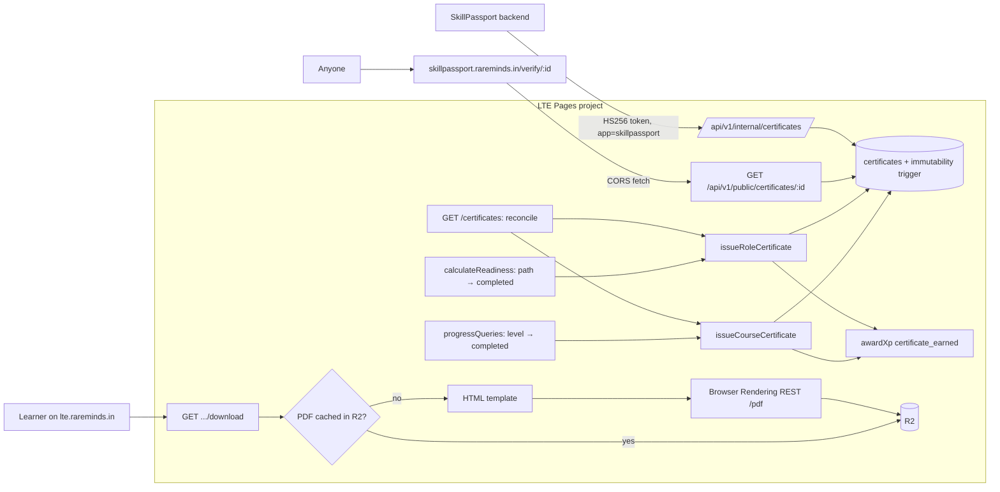

# LTE Certificate System — Implementation Plan (v4)

**Date**: 2026-10-08
**Status**: Implemented; local validation recorded in [verification report](../verifications/2026-10-08-certificate-system.md). Deployment excluded by the user’s latest instruction.
**Scope**: `lte/` (Cloudflare Pages Functions + Supabase + React/Vite FSD frontend), plus one public verification page in `skillpassport/`
**Supersedes**: v1–v3 of this file (same path). v1 audit findings and their resolutions are in §2.2.

---

## Table of Contents

1. [Summary](#1-summary)
2. [Decisions Log & v1 Audit Resolutions](#2-decisions-log--v1-audit-resolutions)
3. [Verified Codebase Facts](#3-verified-codebase-facts)
4. [Architecture](#4-architecture)
5. [Certificate Types & Issuance Rules](#5-certificate-types--issuance-rules)
6. [Database Design](#6-database-design)
7. [Backend Core Library](#7-backend-core-library)
8. [API Design](#8-api-design)
9. [PDF Rendering (Browser Rendering, no new Worker)](#9-pdf-rendering-browser-rendering-no-new-worker)
10. [Frontend Design](#10-frontend-design)
11. [Security, Privacy & Compliance](#11-security-privacy--compliance)
12. [Performance, Observability & Configuration](#12-performance-observability--configuration)
13. [Rollout & Risks](#13-rollout--risks)
14. [Task Breakdown](#14-task-breakdown)
15. [Open Items](#15-open-items)

---

## 1. Summary

LTE tracks level ("course") and learning-path ("role") completion but has no way to issue, store, render, verify, or share certificates. The frontend only has placeholders (`LevelModuleList.tsx`, `LevelStatsBar.tsx`, `LevelModulesPage.tsx`).

This plan delivers:

| Deliverable | Description |
|---|---|
| `certificates` table | Immutable snapshot of each issued certificate, enforced by a database trigger. One per user per course, one per user per role. |
| Issuance | Hooked into the two real completion transitions, plus a reconcile pass that self-heals missed issuances and covers learners who completed before launch. |
| PDF | Rendered **on first download** through the Cloudflare Browser Rendering REST API, called directly from the existing LTE Pages Functions. Cached in R2. No new Worker, no Queue, no QR code. |
| Public verification | Unauthenticated LTE API (authoritative database lookup) + public page at `https://skillpassport.rareminds.in/verify/:credentialId`. The verify URL is printed (as a clickable link) on every PDF. |
| SkillPassport access | Internal LTE endpoints SkillPassport calls to pull certificates and PDFs, authenticated with the existing shared internal secret. No events. |
| LTE frontend | Download / copy-link on the level page and a "My Certificates" page. |
| XP | `certificate_earned` event (configurable amount, engagement category). |

**Only new secret**: `BROWSER_RENDERING_API_TOKEN` (D15). Everything else reuses existing configuration.

Estimated effort: **~69h** (§14).

---

## 2. Decisions Log & v1 Audit Resolutions

### 2.1 Decisions

| # | Decision | Source |
|---|---|---|
| D1 | PDF via **Cloudflare Browser Rendering**, called from the existing Pages project. **No new Worker, no Queue.** Pages Functions cannot bind Browser Rendering, so the REST API is used with an account API token. | User |
| D2 | Role certificate is issued when `learning_paths.status` transitions to `completed` (matches existing logic in `calculateReadiness`). Readiness score is not a condition. | User |
| D3 | No sync events. LTE exposes **internal endpoints SkillPassport calls** to fetch certificates. Building the SkillPassport-side import/consumer is out of scope. | User |
| D4 | Cloudflare account is on **Workers Paid** (30 Browser Rendering requests/s). | User |
| D5 | Verify links use **`https://skillpassport.rareminds.in`**. Consequence: the public verify page is built in SkillPassport (`/verify/:credentialId`) and reads LTE's public verify API. No verify page in the LTE frontend. | User |
| D6 | **No QR code.** The PDF prints the credential ID and the verify URL as a clickable link. | User |
| D7 | SkillPassport→LTE calls reuse the existing shared secret (`SKILLPASSPORT_INTERNAL_SECRET` in LTE = `LTE_INTERNAL_SECRET` in SkillPassport). Call direction is separated by the token's `app` claim and action scoping. | User |
| D8 | **No rollout switch.** Certificates go live on deploy. | User |
| D9 | **No rollback plan.** | User |
| D10 | Course certificate is issued on **any** level completion, not only on-time completion. | Audit |
| D11 | Uniqueness is on the natural key `(user_id, level_id)` / `(user_id, role_id)`, not on a progress row, so re-imported or re-versioned learning paths never duplicate certificates. | Audit |
| D12 | Missing learner name → certificate is created as `pending_name` and the learner is prompted to add their name in Settings. Email is never printed. | Proposed |
| D13 | Revocation is a service function only (no HTTP endpoint) because LTE has no admin role yet. | Proposed |
| D14 | `certificate_earned` = 50 XP, category `engagement` (does not inflate readiness). | Proposed |
| D15 | **No new secrets except `BROWSER_RENDERING_API_TOKEN`**, which Browser Rendering from Pages cannot work without. | User |
| D16 | **No HMAC signing key.** Authenticity comes from the authoritative database lookup by an unguessable 80-bit credential ID; integrity comes from a `BEFORE UPDATE` trigger that makes issued certificates immutable (§6.1). | Follows D15 |

**Why D16 is sufficient**: a forged or edited PDF never passes verification, because the verify page shows what LTE's database holds, not what the PDF says. The removed HMAC only detected direct database edits; the immutability trigger prevents those edits instead. `service_role` (used by all LTE code) is not the table owner, so it cannot disable the trigger.

### 2.2 v1 Findings → Resolution

| # | v1 problem | Resolution |
|---|---|---|
| 1 | Queue consumer inside Pages Functions (not possible); existing consumer throws on unknown types | No queue. Render on first download (§9). |
| 2 | Hooked into `completeCourseOnTime()` (conditional — late finishers never certified) | Hook at the level-completion transition in `progressQueries.ts` (§7.6). |
| 3 | Role trigger required readiness = 100 (may never happen) | D2: status `completed` only. |
| 4 | `certificate_earned` added only in TS/JSON; `xp_event_type` is a DB enum | Migration `ALTER TYPE ... ADD VALUE` (§6.3). |
| 5 | `learner_name` assumed available; `users` has nullable `first_name`/`last_name` only | `pending_name` status + Settings prompt (D12). |
| 6 | Unique key on progress row → duplicates across learning-path versions | Partial unique indexes on natural keys (§6.1). |
| 7 | HMAC excluded displayed fields; key version stored in `metadata` | HMAC removed (D16); displayed fields locked by an immutability trigger (§6.1). |
| 8 | 32-bit credential ID (collisions, guessable) | 80-bit Crockford base32 + collision retry (§7.1). |
| 9 | 1h public cache on verify hides revocations | `max-age=60` (§8.3). |
| 10 | Claimed "R2 is private"; bucket has a public custom domain | Unguessable 128-bit key segment; PDF never served by public URL (§9.4). |
| 11 | Grants to `authenticated`, contrary to newest convention | `REVOKE ALL` from `PUBLIC, anon, authenticated`; `service_role` only (§6.2). |
| 12 | Revocation half-specified | Service function + tests (§7.6, D13). |
| 13 | Certificates deleted when learning path deleted | `learning_path_id` / `level_progress_id` are `ON DELETE SET NULL` (§6.1). |
| 14 | Level can revert to `in_progress` when modules are added | Issued certificates remain valid (§5.3). |
| 15 | Public route, rate limit, CORS, page placement not specified | §8.3, §10.5. |
| 16 | Pages secrets set via `wrangler secret put` | `wrangler pages secret put` (§12.4). |
| 17 | E2E tasks assumed Playwright exists | Open item (§15). |
| 18 | ADR naming `ADR-008_...` | `lte/.kiro/adr/2026-10-08-certificate-system.md`. |
| 19 | Root `.kiro/architecture/` not checked | Checked: no LTE or certificate architecture doc exists; the ADR covers the decision. |

---

## 3. Verified Codebase Facts

Every design choice below is grounded in these. Paths relative to `lte/` unless prefixed with `skillpassport/`.

**Routing & auth**
- Cloudflare Pages file-based routing. `functions/[[path]].ts` is the lowest-priority fallback; specific route files win. `functions/api/v1/certificates/[credentialId].ts` works without registration.
- No global auth middleware. Auth is opt-in per folder via `_middleware.ts` calling `requireAuth` (`functions/middleware/auth.ts`, wraps `@rareminds-eym/auth-core`), e.g. `functions/api/v1/artifacts/_middleware.ts`. `getAuthUser(context)` reads the user.
- Public route precedent: `functions/api/v1/auth/sso/exchange.ts` (no middleware).
- Rate limiting: `checkDistributedRateLimit(kv, key, { namespace, limit, windowSeconds })` in `functions/middleware/distributed-rate-limiter.ts` + `rateLimitErrorResponse` in `rate-limiter.ts`. Throws if `RATE_LIMIT_KV` missing. Used in `functions/api/v1/reviews/[[path]].ts`.

**Data access**
- All DB access through QueryGateway (`functions/lib/query-gateway/`), enforced by `lint:gateway`. `createServiceQueryGateway(env)` uses service role.
- Policies: `read` (`columns`, `filters`, `sorts`, `maxPageSize`), `insert` (`insertColumns`, `returningColumns`), `update` (`updateColumns`, `filters`, `requireFilter`), `upsert` (`onConflict` only — **no DO NOTHING**), `rpc`. `ownership` is optional.
- Idempotency pattern: plain insert, catch `QueryGatewayDatabaseError` with `cause.code === "23505"` (`awardXp` in `functions/lib/xp-engine.core.ts`).

**Completion detection**
- Level → `completed` happens only in `functions/api/v1/courses/progressQueries.ts` (reads previous status, updates, then on `isCompleted && !wasCompleted` calls `completeCourseOnTime` conditionally and `triggerReadinessRecalculation`).
- Learning path → `completed` happens in `calculateReadiness` (`functions/lib/xp-engine.progress.ts`) when all level-progress rows are `completed`. The previous status is already read (`readinessLearningPathReadPolicy` includes `status`).
- `completeCapability()` has no callers in the request path.

**Schema**
- `users`: `id` (= SSO id), `email`, nullable `first_name`, `last_name`. No RLS. The review flow may create users with only `id` + `email`.
- `levels` = courses (one per capability per level), unique `(capability_id, level_id)`; `level_scale.level_no` 1..5; `capabilities`; `roles.role_name`.
- `user_capability_level_progress`: unique `(user_id, learning_path_id, level_id)`, `status` free varchar, `badge` free varchar default `'none'`, `completed_at`.
- `learning_paths`: versioned (`version_no`, `is_latest`), CHECK `status IN (not_started, in_progress, completed, paused)`, `badge IN (developing, skilled, mastery)`, `completed_at`. Atomic re-import exists (`20261006100200_atomic_learner_track_import.sql`).
- `xp_events.event_type` is enum `public.xp_event_type`; `source_type varchar(50)` unconstrained; `idempotency_key` unique.
- `public.set_updated_at()` exists. Latest migration prefix: `20261006100300`.
- Newer tables: `REVOKE ALL ... FROM PUBLIC, anon, authenticated` + grant to `service_role` only.

**Infra**
- `wrangler.toml`: `RATE_LIMIT_KV`, `SSO_SERVICE`, `LTE_SYNC_QUEUE` (producer only), `STORAGE_BUCKET` (R2 `lte`), `R2_PUBLIC_DOMAIN=https://bucket.lte.rareminds.in` in every env; `SKILLPASSPORT_INTERNAL_URL` = `http://localhost:8788` (local), `https://skillpassport-dev.pages.dev` (preview), `https://skillpassport.rareminds.in` (production).
- R2 helpers in `functions/lib/r2-client.ts`: `createObjectKey`, `putObject`, `getObject`, `headObject`.
- `LteEnv` in `functions/shared/types.ts`; runtime validation `validateBackendEnv` in `functions/lib/env.ts` (already requires `SKILLPASSPORT_INTERNAL_SECRET` ≥ 32 chars).
- LTE→SkillPassport internal auth: HS256 service token `{ app: "lte", actions, iat, exp }` + user claim, signed with `SKILLPASSPORT_INTERNAL_SECRET` (`functions/lib/skill-gateway.ts`); verified by `skillpassport/functions/api/internal/lte/v1/auth.ts` (`verifyServiceToken`, `safeEqual`).
- No Worker in the repo has a `browser` binding, and no Cloudflare API token exists in any config — hence D15.

**Browser Rendering (Cloudflare docs)**
- Pages Functions bindings and Pages Wrangler configuration do not include Browser Rendering; REST API is `POST https://api.cloudflare.com/client/v4/accounts/<accountId>/browser-run/pdf` accepting `html`, `pdfOptions`, and request-blocking options; token needs *Browser Rendering – Edit*.
- Workers Paid limits: 30 quick-action requests/s, 60s browser timeout. Rate-limited responses are HTTP 429 with `Retry-After`.

**LTE frontend**
- Routes in `src/app/router/AppRouter.tsx`. Auth enforced by `DashboardLayout` / `LevelPlayerLayout`.
- `apiFetch` / `apiFetchBlob` in `src/shared/api/client.ts` (through `authClient`).
- React Query 5, zod 4, zustand 5, framer-motion, react-hot-toast. No modal or PDF-generation library.
- `CertificateIcon` at `src/shared/ui/icons/CertificateIcon.tsx`. Sidebar nav map in `DashboardLayout.tsx`.
- Tests: vitest; frontend tests in `src/__tests__/**` (`lint:testlayout`), backend in `functions/**/__tests__/`, SQL in `supabase/tests/`. No Playwright.
- FSD enforced by `steiger` (recommended config).

**SkillPassport**
- Has its own `certificates` table: `title, issuer, level, credential_id, link, issued_on, description, status, document_url, platform, category, expiry_date, ...`. The internal API response maps onto these fields.
- `skillpassport/wrangler.toml` has `LTE_APP_URL = "https://lte.rareminds.in"` and secret `LTE_INTERNAL_SECRET`.
- Public SPA routes live in `skillpassport/src/app/routes/publicRoutes.jsx` (lazy-loaded). Only `/verify-email` exists under "verify"; `/verify/:credentialId` is free.

---

## 4. Architecture



**Properties**
- Issuance never blocks or fails the progress update (non-fatal, self-healed by reconcile).
- PDF rendering happens only on demand and only once per certificate per template version.
- No new Cloudflare Worker, no Queue, no change to `auth-sync-consumer`. One new secret (D15).

---

## 5. Certificate Types & Issuance Rules

### 5.1 Course Completion (`course_completion`)

| Field | Value |
|---|---|
| Scope | One course = one `levels` row (capability × level) |
| Trigger | `user_capability_level_progress.status` transitions to `completed` (any timing) |
| Uniqueness | `(user_id, level_id)` |
| Snapshot | learner name, course title (`levels.title`), capability name, level label (`Level N` from `level_scale.level_no`), badge (`user_capability_level_progress.badge`, `'none'` → `NULL`), completion date (`completed_at`) |
| Metadata | `{ capabilityCode, levelCode, moduleCount, durationMinutes, learningPathId }` |

### 5.2 Role Readiness (`role_readiness`)

| Field | Value |
|---|---|
| Scope | One target role |
| Trigger | `learning_paths.status` transitions to `completed` |
| Uniqueness | `(user_id, role_id)` |
| Snapshot | learner name, role name (`roles.role_name`), track name, badge (`learning_paths.badge`), readiness score, completion date (`learning_paths.completed_at`) |
| Metadata | `{ learningTrackId, readinessScore, capabilities: [{ code, name, levelLabel }] }` |

### 5.3 Rules

1. **Immutability**: once `issued`, displayed fields never change — enforced by the database trigger, not just by code. Corrections use the ops-only atomic revoke + replacement RPC; the old credential stays frozen and revoked.
2. **No retraction on regression**: if a level reverts to `in_progress` (new modules published), the issued certificate stays valid; its date reflects the original completion.
3. **Idempotent**: concurrent or repeated triggers return the existing certificate.
4. **Name required**: without a learner name the row is `pending_name` (not verifiable, not downloadable) until the name exists; it then moves to `issued`.
5. **Live on deploy**: no feature switch (D8). Earlier completers receive certificates through reconcile the next time they open the certificates list or a completed level.

### 5.4 Future types (schema-ready, not implemented)

`skill_badge`, `track_completion`, `capstone_distinction`, Open Badges 3.0 / W3C VC export (would need a signing key at that point). Adding a type = new enum value + CHECK update.

---

## 6. Database Design

All files in `lte/supabase/migrations/`. DDL/DCL only — no DML (per `04-database-api-standards.md`). Expand phase only; nothing existing changes.

### 6.1 `20261008100000_create_certificates.sql`

```sql
-- ============================================================================
-- Migration: Create certificates table
-- Phase: Expand (additive only)
-- Breaking: No
-- ============================================================================

BEGIN;

CREATE TYPE public.certificate_type AS ENUM (
  'course_completion',
  'role_readiness'
);

CREATE TYPE public.certificate_status AS ENUM (
  'pending_name',  -- completion recorded; learner name missing
  'issued',        -- verifiable, downloadable, immutable
  'revoked'        -- invalidated by ops; verify reports revoked; frozen
);

CREATE TABLE public.certificates (
  id uuid PRIMARY KEY DEFAULT gen_random_uuid(),

  -- Public identifier used in verify URLs. Format: LTE-<16 Crockford base32>.
  credential_id varchar(24) NOT NULL,

  user_id uuid NOT NULL
    REFERENCES public.users(id) ON UPDATE CASCADE ON DELETE CASCADE,

  certificate_type public.certificate_type NOT NULL,
  status public.certificate_status NOT NULL DEFAULT 'pending_name',

  -- Natural subject (exactly one, by type)
  level_id uuid
    REFERENCES public.levels(id) ON UPDATE CASCADE ON DELETE RESTRICT,
  role_id uuid
    REFERENCES public.roles(id) ON UPDATE CASCADE ON DELETE RESTRICT,

  -- Provenance (may disappear on re-import; certificate must survive)
  learning_path_id uuid
    REFERENCES public.learning_paths(id) ON UPDATE CASCADE ON DELETE SET NULL,
  level_progress_id uuid
    REFERENCES public.user_capability_level_progress(id) ON UPDATE CASCADE ON DELETE SET NULL,

  -- Immutable display snapshot
  learner_name varchar(255),
  title varchar(500) NOT NULL,
  subtitle varchar(500),
  level_label varchar(100),
  badge varchar(20),
  completion_date timestamptz NOT NULL,
  metadata jsonb NOT NULL DEFAULT '{}'::jsonb,
  issued_at timestamptz,

  -- PDF cache
  pdf_object_key varchar(500),
  pdf_template_version smallint,
  pdf_generated_at timestamptz,

  -- Revocation
  revoked_at timestamptz,
  revoked_reason text,
  revoked_by uuid
    REFERENCES public.users(id) ON UPDATE CASCADE ON DELETE SET NULL,

  created_at timestamptz NOT NULL DEFAULT now(),
  updated_at timestamptz NOT NULL DEFAULT now(),

  CONSTRAINT uq_certificates_credential_id UNIQUE (credential_id),

  CONSTRAINT chk_certificates_credential_format
    CHECK (credential_id ~ '^LTE-[0-9A-HJKMNP-TV-Z]{16}$'),

  CONSTRAINT chk_certificates_subject
    CHECK (
      (certificate_type = 'course_completion' AND level_id IS NOT NULL AND role_id IS NULL)
      OR
      (certificate_type = 'role_readiness' AND role_id IS NOT NULL AND level_id IS NULL)
    ),

  CONSTRAINT chk_certificates_badge
    CHECK (badge IS NULL OR badge IN ('developing', 'skilled', 'mastery')),

  CONSTRAINT chk_certificates_issued_fields
    CHECK (
      status = 'pending_name'
      OR (
        learner_name IS NOT NULL
        AND length(btrim(learner_name)) > 0
        AND issued_at IS NOT NULL
      )
    ),

  CONSTRAINT chk_certificates_revoked_fields
    CHECK (status <> 'revoked' OR revoked_at IS NOT NULL),

  CONSTRAINT chk_certificates_pdf_fields
    CHECK (
      pdf_object_key IS NULL
      OR (pdf_template_version IS NOT NULL AND pdf_generated_at IS NOT NULL)
    )
);

-- One certificate per user per course / per role, across learning-path versions
CREATE UNIQUE INDEX uq_certificates_user_level
  ON public.certificates (user_id, level_id)
  WHERE certificate_type = 'course_completion';

CREATE UNIQUE INDEX uq_certificates_user_role
  ON public.certificates (user_id, role_id)
  WHERE certificate_type = 'role_readiness';

CREATE INDEX idx_certificates_user_status
  ON public.certificates (user_id, status);

-- SkillPassport incremental pull (updatedSince + cursor)
CREATE INDEX idx_certificates_updated_at_id
  ON public.certificates (updated_at, id);

-- ============================================================================
-- Immutability (replaces HMAC signing; see plan D16)
-- Allowed transitions:
--   pending_name → pending_name | issued   (snapshot may be set until issued)
--   issued       → issued (PDF cache columns only) | revoked (revocation columns only)
--   revoked      → revoked (no changes)
-- Always allowed: provenance FKs set to NULL by ON DELETE SET NULL; updated_at.
-- Identity columns never change.
-- ============================================================================

CREATE OR REPLACE FUNCTION public.certificates_enforce_immutability()
RETURNS trigger
LANGUAGE plpgsql
AS $$
BEGIN
  IF NEW.id IS DISTINCT FROM OLD.id
     OR NEW.credential_id IS DISTINCT FROM OLD.credential_id
     OR NEW.user_id IS DISTINCT FROM OLD.user_id
     OR NEW.certificate_type IS DISTINCT FROM OLD.certificate_type
     OR NEW.level_id IS DISTINCT FROM OLD.level_id
     OR NEW.role_id IS DISTINCT FROM OLD.role_id
     OR NEW.created_at IS DISTINCT FROM OLD.created_at THEN
    RAISE EXCEPTION 'certificate identity is immutable (credential %)', OLD.credential_id
      USING ERRCODE = 'check_violation';
  END IF;

  IF (NEW.learning_path_id IS DISTINCT FROM OLD.learning_path_id AND NEW.learning_path_id IS NOT NULL)
     OR (NEW.level_progress_id IS DISTINCT FROM OLD.level_progress_id AND NEW.level_progress_id IS NOT NULL) THEN
    RAISE EXCEPTION 'certificate provenance can only be cleared (credential %)', OLD.credential_id
      USING ERRCODE = 'check_violation';
  END IF;

  IF OLD.status = 'pending_name' THEN
    RETURN NEW;  -- snapshot editable until issued; ops may also revoke a pending row
  END IF;

  IF NEW.learner_name IS DISTINCT FROM OLD.learner_name
     OR NEW.title IS DISTINCT FROM OLD.title
     OR NEW.subtitle IS DISTINCT FROM OLD.subtitle
     OR NEW.level_label IS DISTINCT FROM OLD.level_label
     OR NEW.badge IS DISTINCT FROM OLD.badge
     OR NEW.completion_date IS DISTINCT FROM OLD.completion_date
     OR NEW.metadata IS DISTINCT FROM OLD.metadata
     OR NEW.issued_at IS DISTINCT FROM OLD.issued_at THEN
    RAISE EXCEPTION 'issued certificate content is immutable (credential %)', OLD.credential_id
      USING ERRCODE = 'check_violation';
  END IF;

  IF OLD.status = 'issued' AND NEW.status = 'pending_name' THEN
    RAISE EXCEPTION 'issued certificate cannot return to pending_name (credential %)', OLD.credential_id
      USING ERRCODE = 'check_violation';
  END IF;

  IF OLD.status = 'revoked' THEN
    IF NEW.status IS DISTINCT FROM OLD.status
       OR NEW.revoked_at IS DISTINCT FROM OLD.revoked_at
       OR NEW.revoked_reason IS DISTINCT FROM OLD.revoked_reason
       OR NEW.revoked_by IS DISTINCT FROM OLD.revoked_by
       OR NEW.pdf_object_key IS DISTINCT FROM OLD.pdf_object_key
       OR NEW.pdf_template_version IS DISTINCT FROM OLD.pdf_template_version
       OR NEW.pdf_generated_at IS DISTINCT FROM OLD.pdf_generated_at THEN
      RAISE EXCEPTION 'revoked certificate is frozen (credential %)', OLD.credential_id
        USING ERRCODE = 'check_violation';
    END IF;
  END IF;

  RETURN NEW;
END;
$$;

CREATE TRIGGER trg_certificates_enforce_immutability
BEFORE UPDATE ON public.certificates
FOR EACH ROW
EXECUTE FUNCTION public.certificates_enforce_immutability();

CREATE TRIGGER trg_certificates_set_updated_at
BEFORE UPDATE ON public.certificates
FOR EACH ROW
EXECUTE FUNCTION public.set_updated_at();

COMMENT ON TABLE public.certificates IS
  'Immutable certificate snapshots for course (level) and role (learning path) completion. Authenticity = authoritative lookup by credential_id; integrity = trg_certificates_enforce_immutability.';
COMMENT ON COLUMN public.certificates.credential_id IS
  'Public 80-bit identifier (LTE-<16 Crockford base32>) used in verify URLs.';
COMMENT ON COLUMN public.certificates.pdf_object_key IS
  'R2 key of the rendered PDF; contains a 128-bit random segment. Never exposed publicly.';

COMMIT;
```

Notes:
- Both triggers are `BEFORE UPDATE`; PostgreSQL fires them in name order, so the immutability check runs before `set_updated_at`.
- Row-level triggers also fire for `ON DELETE SET NULL` referential actions, which is why clearing provenance FKs is explicitly allowed.
- `ON UPDATE CASCADE` on identity FKs would be rejected by the trigger. UUID primary keys are never updated in this codebase, so this is acceptable and intentional.
- The table owner is `postgres`; `service_role` cannot `ALTER TABLE ... DISABLE TRIGGER`.

### 6.2 `20261008100100_grant_certificates_access.sql`

```sql
BEGIN;

REVOKE ALL ON TABLE public.certificates FROM PUBLIC, anon, authenticated;
GRANT SELECT, INSERT, UPDATE ON TABLE public.certificates TO service_role;
-- No DELETE grant: certificates are revoked, never deleted (except via user CASCADE).

REVOKE ALL ON FUNCTION public.certificates_enforce_immutability() FROM PUBLIC, anon, authenticated;

COMMIT;
```

### 6.3 `20261008100200_add_certificate_earned_xp_event.sql`

```sql
-- Separate migration: a new enum value cannot be used in the transaction that adds it.
ALTER TYPE public.xp_event_type ADD VALUE IF NOT EXISTS 'certificate_earned';
```

### 6.4 SQL tests — `supabase/tests/certificates.sql`

Mirror the style of `supabase/tests/human_review.sql`. Cover:
- `chk_certificates_subject` for both types (wrong FK combinations rejected).
- Same level under two different `learning_path_id`s → second insert rejected by `uq_certificates_user_level`.
- `issued` without name / `issued_at` → rejected.
- `revoked` without `revoked_at` → rejected.
- Credential ID format check.
- **Immutability**: changing `learner_name`, `title`, `badge`, `completion_date`, `metadata` on an `issued` row → rejected; changing identity columns on any row → rejected; `issued → pending_name` → rejected; any change on a `revoked` row → rejected; `pending_name → issued` with name set → allowed; `issued` PDF columns update → allowed; `issued → revoked` → allowed.
- Deleting a learning path → certificate survives with `learning_path_id = NULL` (trigger allows it).
- Deleting a user → certificates removed.
- `anon` / `authenticated` cannot select; `service_role` can.
- `xp_events` accepts `event_type = 'certificate_earned'`.

---

## 7. Backend Core Library

New folder `functions/lib/certificates/` — one concern per file, each with tests in `functions/lib/certificates/__tests__/`.

### 7.1 `credential-id.ts`

```ts
// 10 random bytes = 80 bits = 16 Crockford base32 chars (no I, L, O, U).
export function generateCredentialId(): string;           // "LTE-7Q2M9X4KAB3D8FZR"
export function isValidCredentialId(value: string): boolean;
export const credentialIdSchema: z.ZodString;              // shared by all routes
```

Collision probability is negligible; the insert still retries on `uq_certificates_credential_id` violation (§7.3). The 80-bit space also makes the IDs infeasible to enumerate, which is what protects the public verify endpoint.

### 7.2 `learner-name.ts`

`resolveLearnerName({ first_name, last_name }) → string | null` — trims, collapses whitespace, caps at 255 chars, returns `null` if empty. Never falls back to email.

### 7.3 `issuance.ts`

```ts
export async function issueCourseCertificate(
  source: QueryGatewaySource, env: CertificateEnv,
  input: { userId: string; levelId: string; levelProgressId: string; learningPathId: string },
): Promise<IssueResult>;

export async function issueRoleCertificate(
  source: QueryGatewaySource, env: CertificateEnv,
  input: { userId: string; learningPathId: string },
): Promise<IssueResult>;

export async function finalizePendingNames(
  source: QueryGatewaySource, env: CertificateEnv, userId: string,
): Promise<number>;

type IssueResult = {
  certificateId: string;
  credentialId: string;
  status: "issued" | "pending_name";
  created: boolean;
};
```

Algorithm (both types):
1. Read existing certificate by natural key → if present, return `{ created: false }` (still call `awardXp`, which is idempotent; this heals a crash between insert and XP).
2. Load snapshot data (level / capability / level_scale, or role / track / path) and the user's name.
3. Build the row; if a name is present → `status = issued`, `issued_at = now()`; else `status = pending_name`.
4. Insert. On `23505`: re-read by natural key → found ⇒ concurrent winner, return it; not found ⇒ credential collision, regenerate and retry (max 3).
5. If `issued`, `awardXp(qb, userId, "certificate_earned", "certificates", certificateId, { credential_id, certificate_type })`.
6. Log `certificate.issued` (no PII).

`finalizePendingNames`: read the user's `pending_name` rows; if the user now has a name, update each to `learner_name = <name>`, `status = issued`, `issued_at = now()` (filtered by `id` and `status = pending_name` so it is race-safe), then award XP.

### 7.4 `reconcile.ts`

`ensureCertificatesForUser(source, env, userId)`:
- One read of the user's `user_capability_level_progress` rows with `status = completed` (indexed `(user_id, status)`), one read of `learning_paths` with `status = completed`, one read of the user's certificates.
- Diff in memory; issue missing ones (bounded to 5 per call to protect latency), then `finalizePendingNames`.
- Called from `GET /api/v1/certificates` and after Settings profile name updates. Replaces any DML backfill and self-heals failed hooks.

### 7.5 Hooks into existing code

| Location | Change |
|---|---|
| `functions/api/v1/courses/progressQueries.ts` (block `isCompleted && !wasCompleted && currentProgress?.id`) | Add a **separate** try/catch calling `issueCourseCertificate(qb, env, { userId, levelId, levelProgressId: currentProgress.id, learningPathId })`. Failure is logged, never thrown. Independent of the on-time XP block. If `env` / `learningPathId` aren't in scope, thread them through the caller with minimal signature changes. |
| `functions/lib/xp-engine.progress.ts` `calculateReadiness` | After the learning-path update: if `newStatus === "completed" && learningPath?.status !== "completed"`, call `issueRoleCertificate` in a non-fatal try/catch. |
| `functions/api/v1/settings/profile.ts` | After a successful name update, call `finalizePendingNames` non-fatally. |
| `functions/shared/xp-rewards.json` | `"certificate_earned": 50` |
| `functions/lib/xp-engine.core.ts` | `XP_CATEGORIES.certificate_earned = "engagement"`; `generateIdempotencyKey` case `cert:${userId}:${sourceId}` |

### 7.6 `revocation.ts`

`revokeCertificate(source, { certificateId, reason, actorId })` — update `status = revoked`, `revoked_at`, `revoked_reason`, `revoked_by`; filtered by `id` and `status <> revoked`. Not exposed over HTTP (D13). Tested; usable from an ops script.

`replaceCertificate(source, { certificateId, actorId, reason, corrections })` in `replacement.ts` calls the service-role-only `replace_certificate` RPC added by `20261008100300_certificate_replacements.sql`. The transaction locks the old row, revokes it if needed, inserts one issued child with immutable `supersedes_id`, clears cached PDF fields, and returns the existing child on retry. Only the documented display correction allowlist is accepted; replacements do not award XP. Natural-key uniqueness applies to non-revoked rows, so ordinary issuance still cannot overwrite an active certificate.

### 7.7 `queries.ts`

All QueryGateway policies in one place:

| Policy | Operation | Ownership | Notes |
|---|---|---|---|
| `certificateOwnerReadPolicy` | read | `user_id` required | Learner list / detail / download |
| `certificatePublicReadPolicy` | read | none | Filter allow-list `["credential_id"]` only; columns limited to what verification displays |
| `certificateInternalReadPolicy` | read | none | Filters `user_id`, `updated_at`, `id`, `status`; `maxPageSize: 100` |
| `certificateInsertPolicy` | insert | `user_id` required | |
| `certificateFinalizePolicy` | update | — | `learner_name`, `status`, `issued_at`; `requireFilter: true`, filters `id`, `status` |
| `certificatePdfUpdatePolicy` | update | — | `pdf_object_key`, `pdf_template_version`, `pdf_generated_at`, `updated_at` |
| `certificateRevokePolicy` | update | — | Revocation columns |
| Snapshot reads | read | as needed | `levels`, `capabilities`, `level_scale`, `roles`, `learning_tracks`, `learning_paths`, `users` (name columns only) |

Immutability violations surface as `QueryGatewayDatabaseError` with code `23514` and are logged as errors (they indicate a code bug).

### 7.8 `internal-service-token.ts` (shared helper)

Extract `signServiceToken` from `functions/lib/skill-gateway.ts` and add `verifyServiceToken` (same HS256 format as `skillpassport/functions/api/internal/lte/v1/auth.ts`). `skill-gateway.ts` imports it with no behaviour change.

---

## 8. API Design

All routes under `/api/v1` (`lint:versioning`). JSON responses via the existing `jsonResponse` / `jsonError` helpers with `requestId`. All responses are zod-validated before returning.

### 8.1 Folder layout

```
functions/api/v1/
├── certificates/                      # learner, authenticated
│   ├── _middleware.ts                 # requireAuth (auth-core)
│   ├── index.ts                       # GET list (+ reconcile)
│   ├── schemas.ts                     # zod request/response
│   ├── [credentialId]/
│   │   ├── index.ts                   # GET detail
│   │   └── download.ts                # GET PDF
│   └── __tests__/
├── public/
│   └── certificates/
│       ├── [credentialId].ts          # GET verify (no auth, CORS for SkillPassport)
│       └── __tests__/
└── internal/
    └── certificates/                  # SkillPassport, service token
        ├── _middleware.ts
        ├── index.ts                   # GET list (by user / incremental)
        ├── [credentialId]/pdf.ts      # GET PDF
        └── __tests__/
```

Public and internal routes live in folders that never get the learner auth middleware.

### 8.2 Learner endpoints (authenticated)

**`GET /api/v1/certificates?type=&levelId=`** — rate limit 60/min/user.

```ts
interface CertificateListResponse {
  certificates: CertificateSummary[];
}
interface CertificateSummary {
  credentialId: string;
  certificateType: "course_completion" | "role_readiness";
  status: "pending_name" | "issued" | "revoked";
  title: string;
  subtitle: string | null;
  levelLabel: string | null;
  badge: "developing" | "skilled" | "mastery" | null;
  completionDate: string;   // ISO 8601
  issuedAt: string | null;
  levelId: string | null;
  roleId: string | null;
  verifyUrl: string | null; // https://skillpassport.rareminds.in/verify/<id>; null unless issued
  downloadable: boolean;    // status === "issued"
}
```

**`GET /api/v1/certificates/:credentialId`** — owner only; another user's ID returns **404** (no existence leak).

**`GET /api/v1/certificates/:credentialId/download`** — rate limit 10/min/user.

| Case | Response |
|---|---|
| Not owner / not found | 404 |
| `pending_name` | 409 `NAME_REQUIRED` |
| `revoked` | 410 `CERTIFICATE_REVOKED` |
| Cached PDF with current template version | Stream from R2 |
| No PDF or old template version | Render (§9), store, stream |
| Browser Rendering 429 | 503 `PDF_RENDER_BUSY` + `Retry-After` |
| Render timeout / 5xx | 503 `PDF_RENDER_UNAVAILABLE` |

Headers: `Content-Type: application/pdf`, `Content-Disposition: attachment; filename="<credentialId>.pdf"`, `Cache-Control: private, no-store`, `X-Content-Type-Options: nosniff`.

### 8.3 Public verification (no auth)

**`GET /api/v1/public/certificates/:credentialId`** (+ `OPTIONS` preflight)

- **CORS**: `Access-Control-Allow-Origin` is set only when the request `Origin` equals the origin of `SKILLPASSPORT_INTERNAL_URL` (local `http://localhost:8788`, preview `https://skillpassport-dev.pages.dev`, production `https://skillpassport.rareminds.in`). `GET` only, no credentials, `Vary: Origin`. No new variable needed.
- Validate format with `credentialIdSchema` → 400 on failure.
- Rate limit by `CF-Connecting-IP`: 60/min (namespace `certificate-verify`).
- Authoritative lookup by `credential_id`; the response reflects the database, never the PDF.

```ts
interface CertificateVerifyResponse {
  status: "valid" | "revoked" | "not_found";
  credentialId: string;
  certificateType?: "course_completion" | "role_readiness";
  learnerName?: string;
  title?: string;
  subtitle?: string | null;
  levelLabel?: string | null;
  badge?: string | null;
  completionDate?: string;
  issuedAt?: string;
  revokedAt?: string | null;
  issuer: "Rareminds LTE";
}
```

- `pending_name` → `not_found`.
- Never returns `user_id`, email, `level_id`, `role_id`, metadata, or object keys.
- `Cache-Control: public, max-age=60` (revocation visible within a minute).

### 8.4 SkillPassport internal endpoints

**Auth (`internal/certificates/_middleware.ts`)**
- `Authorization: Bearer <HS256 service token>` signed with the **existing shared secret** (`SKILLPASSPORT_INTERNAL_SECRET` in LTE; `LTE_INTERNAL_SECRET` in SkillPassport) — D7. Same token format as `skill-gateway.ts`.
- Required claims: `app === "skillpassport"`, `actions` includes `"certificates.read"`, `exp > now`, `exp - iat <= 300`, optional `nbf`.
- Direction separation with one secret: LTE-minted tokens carry `app: "lte"` and are rejected here; SkillPassport-minted tokens carry `app: "skillpassport"`. Task T9 confirms SkillPassport's handler rejects tokens whose `app !== "lte"`, so tokens cannot be replayed in the other direction.
- Failures: missing / malformed / expired / bad signature → 401; wrong app / action → 403.
- Rate limit 600/min per `app`.
- Learner authentication still uses `@rareminds-eym/auth-core`; this is service-to-service auth following the existing internal-gateway precedent.

**Envelope** (matches the existing gateway envelope): `{ ok: true, data } | { ok: false, error: { code, message } }`.

**`GET /api/v1/internal/certificates?userId=<uuid>`** — all `issued` and `revoked` certificates for one user (`userId` = SSO user id).

**`GET /api/v1/internal/certificates?updatedSince=<iso>&cursor=<opaque>&limit=<1..100>`** — incremental pull ordered by `(updated_at, id)`; the cursor is base64 JSON `{ updatedAt, id }`, validated like the reviews cursor (length ≤ 512, strict zod). Includes revocations.

```ts
interface InternalCertificate {
  credentialId: string;
  userId: string;                 // SSO user id
  certificateType: "course_completion" | "role_readiness";
  title: string;                  // → certificates.title
  issuer: "Rareminds LTE";        // → certificates.issuer
  level: string | null;           // → certificates.level (levelLabel)
  link: string;                   // → certificates.link (public verify URL)
  issuedOn: string;               // YYYY-MM-DD → certificates.issued_on
  description: string | null;     // → certificates.description (subtitle)
  status: "active" | "revoked";   // → certificates.status
  platform: "LTE";                // → certificates.platform
  category: string;               // → certificates.category
  documentUrl: string;            // internal PDF endpoint (requires service token)
  badge: string | null;
  revokedAt: string | null;
  updatedAt: string;
}
// data: { items: InternalCertificate[]; nextCursor: string | null }
```

**`GET /api/v1/internal/certificates/:credentialId/pdf`** — same render-or-stream logic as the learner download; `issued` only.

The contract is documented in `functions/README.md` for the SkillPassport team.

---

## 9. PDF Rendering (Browser Rendering, no new Worker)

### 9.1 Flow

```
download request
  → read certificate (owner / service)
  → if pdf_object_key && pdf_template_version == CURRENT → stream R2 object
  → else
      html = renderCertificateHtml(snapshot, verifyUrl)
      pdf  = POST Browser Rendering /pdf { html, pdfOptions, blocking }
      validate: content-type pdf, starts with "%PDF-", size ≤ 5 MB
      key  = createObjectKey(certificates / userId / credentialId / random128hex-certificate.pdf)
      putObject(key, pdf, application/pdf)
      update pdf_object_key, pdf_template_version, pdf_generated_at
      stream pdf
```

Concurrent first downloads may both render; the last write wins and both PDFs are identical — harmless. The per-user download rate limit bounds cost.

### 9.2 `pdf-renderer.ts`

```ts
const res = await fetch(
  `https://api.cloudflare.com/client/v4/accounts/${env.CF_ACCOUNT_ID}/browser-run/pdf`,
  {
    method: "POST",
    headers: {
      Authorization: `Bearer ${env.BROWSER_RENDERING_API_TOKEN}`,
      "Content-Type": "application/json",
    },
    body: JSON.stringify({
      html,
      pdfOptions: { format: "a4", landscape: true, printBackground: true, preferCSSPageSize: true },
      // Template is self-contained; block every outbound subresource request (SSRF / tracking).
      rejectRequestPattern: ["^https?://.*"],
    }),
    signal: AbortSignal.timeout(25_000),
  },
);
```

- Typed errors: `PdfRenderRateLimitedError(retryAfterSeconds)` (429), `PdfRenderTimeoutError`, `PdfRenderUpstreamError(status)`.
- No retries inside the request (the user can retry; the 503 carries `Retry-After`).
- Endpoint path and blocking option are re-verified against current Cloudflare docs in T7 (docs list `browser-run/pdf`; an older `browser-rendering/pdf` path exists).
- API token scope: account-level **Browser Rendering – Edit** only. The token is never logged or returned.

### 9.3 `template.ts`

- Self-contained HTML/CSS (A4 landscape), no external URLs; fonts are system fonts or inlined base64 WOFF2; logo inlined as SVG/base64.
- Every interpolated value passes through one `escapeHtml()`; no raw HTML from data.
- Content: logo, "Certificate of Completion" / "Certificate of Role Readiness", learner name, title, subtitle, level label, badge, completion date, authorized signatory (configurable, §15), credential ID, and **"Verify at https://skillpassport.rareminds.in/verify/<credentialId>"** as a clickable link (Chromium keeps `<a href>` links in PDFs). No QR code (D6).
- `CERTIFICATE_TEMPLATE_VERSION` constant; bumping it re-renders PDFs lazily on next download.

### 9.4 R2 storage

- Key built with `createObjectKey({ namespace: "certificates", ownerId: userId, entityId: credentialId, fileId: <128-bit random hex>, fileName: "certificate.pdf" })`.
- The bucket has a public custom domain (`R2_PUBLIC_DOMAIN`), so the random segment makes keys unguessable. PDFs are only ever served through the authenticated or internal endpoints; no public URL is stored or returned.
- Superseded PDFs from older template versions are left in place; orphan cleanup is a later ops task (low volume).

---

## 10. Frontend Design

### 10.1 LTE slices (FSD; public `index.ts` per slice; tests in `src/__tests__/certificates/`)

| Slice | Contents |
|---|---|
| `src/entities/certificate/` | `model/certificateSchemas.ts` (zod), `model/types.ts`, `api/certificateApi.ts` (`apiFetch`, `apiFetchBlob`), `model/useCertificates.ts`, `model/useLevelCertificate.ts` (React Query), `ui/CertificateCard.tsx`, `index.ts` |
| `src/features/certificate-actions/` | `ui/DownloadCertificateButton.tsx` (blob → object URL → download → revoke URL; `aria-busy`; toast on error incl. `Retry-After`), `ui/CopyVerifyLinkButton.tsx` (clipboard + toast; copies the SkillPassport verify URL from the API), `index.ts` |
| `src/pages/certificates/` | "My Certificates" grid, filter by type, empty state, skeleton |

### 10.2 LTE route (`src/app/router/AppRouter.tsx`, lazy-loaded per `lint:lazy`)

| Path | Layout | Auth |
|---|---|---|
| `/certificates` | `DashboardLayout` | Required |

Sidebar: add "Certificates" to `navPathMap`, `pageTitleMap`, and active-nav logic in `DashboardLayout.tsx`, using `CertificateIcon`.

### 10.3 Existing LTE UI wiring

| File | Change |
|---|---|
| `src/widgets/level-modules/ui/LevelModuleList.tsx` (completion card) | When completed and certificate `issued`: Download + Copy link buttons. When `pending_name`: "Add your name in Settings to receive your certificate" with a link to `/settings`. While loading: skeleton. Locked text unchanged. |
| Course completion mutation (where module/stage completion is submitted) | Invalidate `certificates` queries after a completion response. |
| `src/pages/level-modules/ui/LevelModulesPage.tsx` / `LevelStatsBar.tsx` | No change: `hasCertificate={true}` is correct — every course includes a certificate. |
| Settings profile save | Invalidate `certificates` queries (a name may finalize pending certificates). |

### 10.4 Accessibility

Buttons have visible labels and accessible names; download progress via `aria-busy` + live-region toast; status on the verify page conveyed by text and icon (not colour alone); keyboard reachable; contrast via existing design tokens (`lint:tokens`). Full WCAG validation needs manual assistive-technology testing.

### 10.5 SkillPassport public verify page (consequence of D5)

| Item | Detail |
|---|---|
| Route | `/verify/:credentialId` in `skillpassport/src/app/routes/publicRoutes.jsx`, lazy-loaded, no auth guard |
| Page | `skillpassport/src/pages/verify/CertificateVerify.jsx` (follow SkillPassport's existing page/feature conventions) |
| Data | Plain `fetch` (no auth) to `${VITE_LTE_APP_URL}/api/v1/public/certificates/:credentialId` |
| Config | New frontend env var `VITE_LTE_APP_URL` (`https://lte.rareminds.in` production; LTE preview/local URLs elsewhere). Public URL, not a secret. |
| States | `valid` (issuer, learner name, title, level, badge, completion date, issued date), `revoked` (revocation date only), `not_found`, network error, malformed ID |
| SEO / privacy | `noindex` meta |
| Tests | Follow SkillPassport's existing test setup; one test per state |

This is the only SkillPassport change in scope. No SkillPassport backend change.

---

## 11. Security, Privacy & Compliance

### 11.1 Threat model

| Threat | Control |
|---|---|
| Forged or edited PDF | Verification shows the database record, not the PDF; a fake ID returns `not_found`, an edited PDF shows a mismatch to the viewer |
| Direct database edit of an issued certificate | `trg_certificates_enforce_immutability`; `service_role` cannot disable it |
| Credential enumeration | 80-bit IDs; IP rate limit on verify |
| Downloading someone else's PDF | Ownership policy; 404 on mismatch; random R2 key segment |
| XSS / injection in PDF | Single `escapeHtml` path; no raw HTML; network blocked during render |
| SSRF through renderer | Self-contained HTML + request blocking |
| Cross-origin abuse of verify API | CORS allowlist = SkillPassport origin only; read-only, no credentials |
| Internal API abuse | HS256 service token, ≤ 5-min TTL, `app` + action scoping, rate limit |
| Shared-secret token replay across directions | `app` claim checked on both sides (`skillpassport` at LTE, `lte` at SkillPassport) |
| Browser Rendering token leak | Least-privilege scope (Browser Rendering – Edit only); stored as a Pages secret; never logged |
| Renderer cost abuse | Per-user download rate limit; render once per template version |
| SQL injection | QueryGateway parameterized queries only; zod validation on all params |

Accepted trade-offs:
- D7: a leak of the shared internal secret compromises both directions at once. Rotation updates both projects together.
- D16: no offline/cryptographic verification of a PDF; verification always requires the online lookup. Open Badges 3.0 export (future) would reintroduce a signing key.

### 11.2 Authorization matrix

| Operation | Who | Mechanism |
|---|---|---|
| List / detail / download own | Learner | `requireAuth` (auth-core) + `user_id` ownership |
| Verify | Anyone (via SkillPassport page) | Public, rate-limited, minimal fields |
| Read any user's certificates / PDF | SkillPassport backend | Service token |
| Issue | System only | Internal function calls; no HTTP endpoint |
| Revoke | Ops | Service function; no HTTP endpoint |

### 11.3 Privacy (GDPR)

- Public exposure is limited to learner name + certificate facts. Learners control sharing: IDs are unguessable, so a certificate is only discoverable through a link the learner shares.
- Data minimization: no email, internal IDs, XP, or metadata on public or PDF surfaces.
- Erasure: user deletion cascades to certificates (the immutability trigger only covers `UPDATE`, so `DELETE` via cascade works); verify links then return `not_found`. PDF objects under `certificates/users/{userId}/` must be deleted by the same erasure process (runbook note in T13).
- Logs never contain learner names, emails, or tokens (IDs only).

---

## 12. Performance, Observability & Configuration

### 12.1 Targets

| Operation | Target |
|---|---|
| Issuance (inside completion request) | adds p95 < 150 ms; never fails the request |
| `GET /certificates` (reconcile, nothing missing) | p95 < 300 ms |
| Public verify | p95 < 150 ms |
| Download, cached | p95 < 500 ms (R2 stream) |
| Download, first render | p95 < 8 s (Browser Rendering bound) |
| Internal list page (100 items) | p95 < 500 ms |

Local measurements (`npm run certificates:test:local -- --performance`, PostgreSQL + workerd R2/KV, real Cloudflare rendering) passed: issuance 13.20 ms, list/reconcile 10.35 ms, public verify 7.07 ms, first download 1,626.11 ms, cached download 5.62 ms, and internal page 3.69 ms at p95. Deployed measurements remain a rollout check.

### 12.2 Structured logging (`createLogger("certificates")`)

| Event | Fields |
|---|---|
| `certificate.issued` | requestId, certificateId, type, status, created |
| `certificate.replaced` | requestId, certificateId, supersedesId |
| `certificate.issue_failed` | requestId, userId, type, errorCode |
| `certificate.immutability_violation` | requestId, certificateId, operation (error — indicates a code bug) |
| `certificate.render` | requestId, certificateId, durationMs, bytes, templateVersion, outcome |
| `certificate.verify` | requestId, outcome (`valid` / `revoked` / `not_found`) |
| `certificate.internal_read` | requestId, app, mode (`user` / `incremental`), count |

### 12.3 Alerts (via the existing log pipeline)

- Render failure rate > 5% over 15 min.
- Any `certificate.immutability_violation`.
- `certificate.issue_failed` > 10 in 15 min.

Thresholds are versioned in `ops/certificates/alerts.json`. `npm run certificates:monitor` consumes structured certificate log lines and emits deduplicated `firing`/`resolved` JSON transitions without forwarding arbitrary metadata or PII; the deployment log pipeline supplies the notification sink.

### 12.4 Configuration

**LTE** (`LteEnv`, `validateBackendEnv`, `.dev.vars.example`, `wrangler.toml` vars + secrets comment, env tests)

| Name | Kind | Value / notes |
|---|---|---|
| `BROWSER_RENDERING_API_TOKEN` | **secret (only new one)** | Scope: Browser Rendering – Edit. Set via `wrangler pages secret put BROWSER_RENDERING_API_TOKEN --project-name lte` (production and preview); `.dev.vars` locally. |
| `CF_ACCOUNT_ID` | var | Cloudflare account ID (identifier, not a secret) |
| `CERTIFICATE_VERIFY_BASE_URL` | var | Production `https://skillpassport.rareminds.in/verify`; preview `https://skillpassport-dev.pages.dev/verify`; local `http://localhost:8788/verify`. Printed on every PDF — treat as permanent. |
| `SKILLPASSPORT_INTERNAL_SECRET` | secret | **Existing**; now also verifies inbound SkillPassport tokens |

**SkillPassport**

| Name | Kind | Value / notes |
|---|---|---|
| `VITE_LTE_APP_URL` | frontend env (public) | `https://lte.rareminds.in` in production |
| `LTE_INTERNAL_SECRET` | secret | **Existing**; used when SkillPassport later calls the internal API |

---

## 13. Rollout & Risks

### 13.1 Rollout order

Certificates go live on deploy (D8), so order matters:

1. Create the Browser Rendering API token; set `BROWSER_RENDERING_API_TOKEN`, `CF_ACCOUNT_ID` and `CERTIFICATE_VERIFY_BASE_URL` in preview and production.
2. Apply migrations (preview → production) **before** deploying code. If code ships first, issuance fails non-fatally and reconcile catches up after migrations.
3. Deploy LTE to preview; set `VITE_LTE_APP_URL` and deploy SkillPassport to preview.
4. Run the end-to-end demo in preview (T14).
5. Deploy LTE, then SkillPassport, to production. Monitor §12.3 alerts for 24h. Earlier completers receive certificates via reconcile.
6. Share the internal API contract (`functions/README.md`) with the SkillPassport team.

Rollback plan: not required (D9).

### 13.2 Risks

| Risk | Likelihood | Impact | Mitigation |
|---|---|---|---|
| Browser Rendering 429 / outage | Low | Low | Render once + R2 cache; 503 with `Retry-After`; certificate still verifiable |
| Wrong completion → wrong certificate | Low | High | Natural-key idempotency; revocation function |
| Immutability trigger blocks a legitimate future update | Low | Medium | Allowed transitions documented in §6.1; changes go through a new migration |
| Missing names leave many `pending_name` | Medium | Medium | Settings prompt; finalize on name update and on list |
| New required env vars break deploys | Medium | Medium | Rollout step 1 before deploy |
| Verify page domain differs from LTE domain | n/a | Medium | CORS allowlist from `SKILLPASSPORT_INTERNAL_URL`; tested in T6 and T14 |
| Shared internal secret leak affects both directions | Low | High | Accepted (D7); `app` claim scoping; joint rotation |
| R2 bucket publicly reachable | Unknown | Medium | Unguessable keys; confirm dashboard setting (§15) |
| SSO user id ≠ SkillPassport learner id | Unknown | Medium | Internal API returns SSO id; confirm (§15) |

---

## 14. Task Breakdown

**Execution amendment (2026-10-08):** The user explicitly requested “dont deploy to anywhere. test locally only.” This supersedes the earlier lte-dev/skillpassport-dev selection and the preview deployment portion of T14. Run the demo locally; do not apply remote migrations, set remote secrets, or deploy. T1 uses an isolated local schema copy plus four additive local migrations, preserving existing development data instead of resetting it. T1–T14 local scope is complete; repository-wide unrelated lint/type failures and deployment-only checks are recorded honestly in the verification report.

Each task ends in a demoable, tested state. Run `npm run test:dev` (lint checks + steiger + vitest) in `lte/` at the end of every LTE task. After code changes run `graphify update .` from inside `lte/`.

| # | Task | Effort | Depends on |
|---|---|---|---|
| T1 | Four migrations incl. immutability/replacement triggers (§6.1–6.3) + `supabase/tests/certificates.sql` (§6.4); additive local application without reset | 5h | — |
| T2 | Env/config (§12.4); `credential-id.ts`, `learner-name.ts`; extract `internal-service-token.ts` from `skill-gateway.ts` (no behaviour change) | 4h | — |
| T3 | `queries.ts`, `issuance.ts`, `revocation.ts`, `replacement.ts`; XP config for `certificate_earned` | 6h | T1, T2 |
| T4 | Hooks in `progressQueries.ts`, `calculateReadiness`, settings profile; `reconcile.ts` | 5h | T3 |
| T5 | Learner list + detail APIs (`certificates/_middleware.ts`, `index.ts`, `[credentialId]/index.ts`, `schemas.ts`) | 4h | T4 |
| T6 | Public verify API with CORS + IP rate limit | 3.5h | T3 |
| T7 | `template.ts` (verify link, no QR) + `pdf-renderer.ts`; local script renders a real sample PDF | 6h | T2 |
| T8 | `storage.ts` + learner download endpoint | 4h | T5, T7 |
| T9 | SkillPassport internal APIs (shared-secret token, `app` scoping) + contract in `functions/README.md`; confirm SkillPassport rejects `app !== "lte"` | 6h | T3, T8 |
| T10 | LTE frontend `entities/certificate`, `features/certificate-actions` | 5h | T5, T8 |
| T11 | LTE level page wiring + `/certificates` page + sidebar nav | 6h | T10 |
| T12 | SkillPassport public `/verify/:credentialId` page + `VITE_LTE_APP_URL` | 4h | T6 |
| T13 | Observability (§12.2), ADR `lte/.kiro/adr/2026-10-08-certificate-system.md`, README/env docs, erasure runbook note, verification report in `lte/.kiro/verifications/`, coverage ≥ 80% on new code | 6h | All |
| T14 | Local browser end-to-end demo (deployment excluded by execution amendment) | 4h | All |
| | **Total** | **~69h** | |

### Acceptance criteria

**T1** — SQL tests pass, including every immutability case in §6.4; duplicate course certificate across two learning paths rejected; `certificate_earned` insertable into `xp_events`; anon/authenticated have no access.

**T2** — Credential IDs match `^LTE-[0-9A-HJKMNP-TV-Z]{16}$` and use `crypto.getRandomValues`; name resolution handles null/blank/whitespace; `env.test.ts` and `skill-gateway.test.ts` green.

**T3** — Unit tests (mocked gateway): fresh issue; repeat call returns existing (`created: false`); concurrent `23505` returns the winner; credential collision retries; missing name → `pending_name` → finalize → `issued`; XP awarded exactly once; `23514` from the trigger is logged and rethrown.

**T4** — Level completion (on-time **and** late) issues a course certificate; an issuance failure does not fail the progress update; path completion issues a role certificate; reconcile back-issues missing certificates and respects the batch bound.

**T5** — 401 without a token; owner sees only own rows; another user's ID → 404; filters work; response matches schema; `verifyUrl` uses `CERTIFICATE_VERIFY_BASE_URL`; rate limit enforced.

**T6** — `valid`, `revoked`, `not_found`, `pending_name` → `not_found`; malformed ID → 400; 429 on flood; no internal fields in the body; `Cache-Control: public, max-age=60`; CORS header present only for the SkillPassport origin; preflight handled.

**T7** — Template escapes `<script>`, quotes and ampersands; contains no `http(s)://` subresources; verify link present and correct; renderer (mocked fetch) sends the correct URL, auth header, body and blocking options; maps 429 / timeout / 5xx to typed errors; rejects non-PDF bodies; token never appears in logs; the real-API script produces a valid PDF with a working link.

**T8** — Cache hit does not call the renderer; cache miss renders, stores, updates the row; a template-version bump triggers re-render; `pending_name` → 409, `revoked` → 410; render 429 → 503 + `Retry-After`; headers correct; key contains a 32-hex random segment.

**T9** — 401 for missing / expired / bad-signature token; 403 for `app: "lte"` tokens and wrong action; field mapping matches §8.4; cursor paging stable; revocations included; malformed cursor → 400; PDF endpoint streams for `issued` only.

**T10** — Schemas parse real API fixtures; hooks fetch correct URLs; download creates and revokes an object URL; copy shows a toast; error toast shows the retry hint; `steiger` and `lint:*` pass.

**T11** — Completed level shows Download + Copy link; `pending_name` shows the Settings prompt; locked state unchanged; `/certificates` lists certificates with an empty state; nav highlights correctly; existing `LevelModuleList` / `LevelModulesPage` tests updated and green.

**T12** — Each state renders; route reachable logged out with no redirect; `noindex` present; SkillPassport lint and tests pass.

**T13** — Logs emitted with request IDs and no PII; executable alert monitor and thresholds; ADR written (records D15/D16 trade-offs); coverage ≥ 80% for new files; verification report lists what was and wasn't verified.

**T14 (local amendment)** — In Playwright: sign in through the local auth boundary → complete a level through the real progress backend → production certificate page lists it → download PDF → open the exact PDF link → SkillPassport shows `valid` while logged out at desktop/mobile sizes with no automated WCAG A/AA violations. The same run performs a signed internal pull, rejects an issued `learner_name` update, verifies revocation, and verifies atomic replacement. No deployment occurs.

---

## 15. Open Items

None of these block starting T1–T11; defaults apply if unanswered.

| # | Item | Why it matters | Default |
|---|---|---|---|
| 1 | **Branding**: logo, colours, authorized signatory name/title/signature image | Template content | Engineering MVP using existing brand tokens; signatory omitted |
| 2 | **E2E tests** | Standards require E2E for critical flows | Resolved: local Playwright harness in T14 |
| 3 | Is the R2 bucket actually public via `bucket.lte.rareminds.in`? | Confirms the need for random keys | Assume public |
| 4 | Does SkillPassport map LTE certificates by **SSO user id**? | Internal API returns `userId` (SSO id), not email | SSO id |
| 5 | XP amount for `certificate_earned` (50, engagement) | Gamification balance | 50 |
| 6 | User-deletion runbook must also delete `certificates/users/{userId}/` in R2 | GDPR erasure completeness | Runbook note in T13 |
| 7 | Plan location: originally requested in the project root; currently `lte/.kiro/plans/` (steering convention) | Discoverability | Keep here |

Resolved: Workers Paid (D4), verify domain (D5), QR (D6), shared secret (D7), rollout switch (D8), rollback plan (D9), new secrets (D15), signing key (D16).

---

*Standards applied: `00-core-standards`, `01-security-compliance` (auth-core for learner auth, OWASP controls, no hardcoded secrets), `02-cloudflare-platform`, `04-database-api-standards` (Expand-only migrations, DDL/DCL in migrations, `/api/v1` versioning, no breaking changes), `05-production-readiness`. Rollback plan omitted by explicit user decision (D9).*
