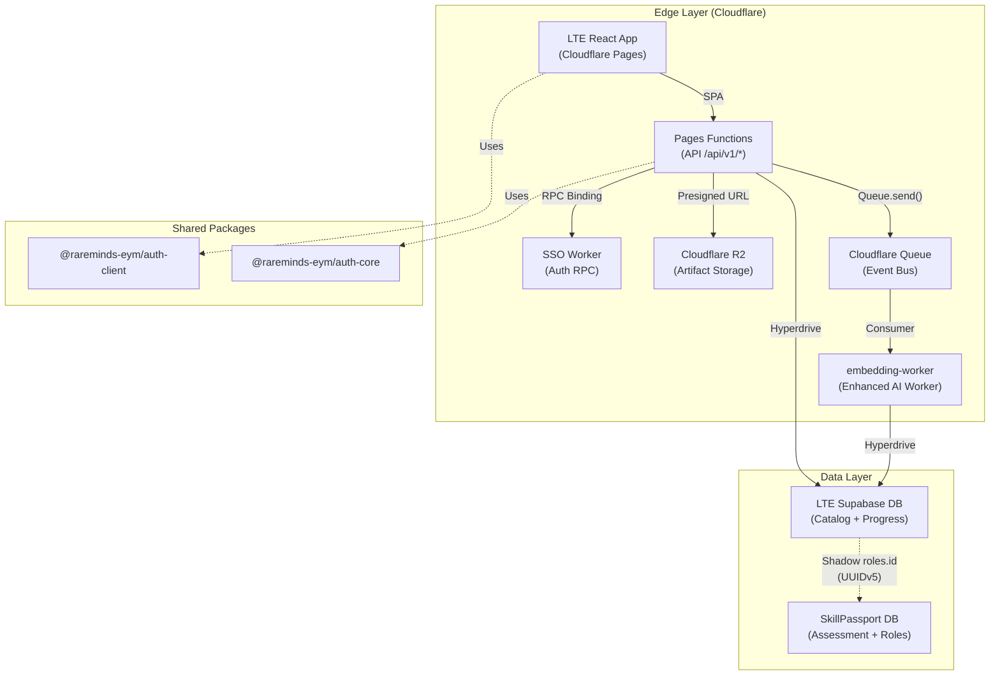
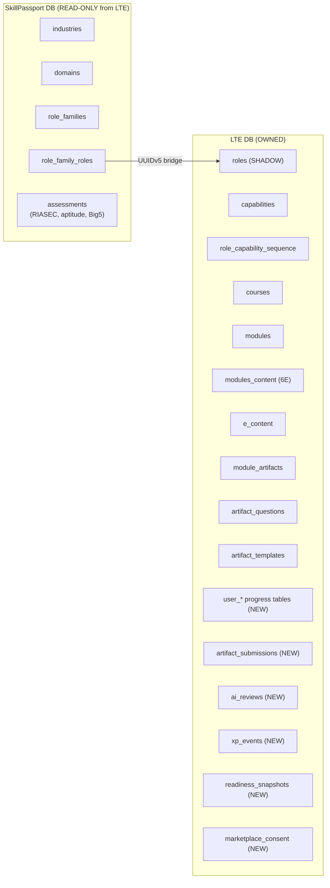
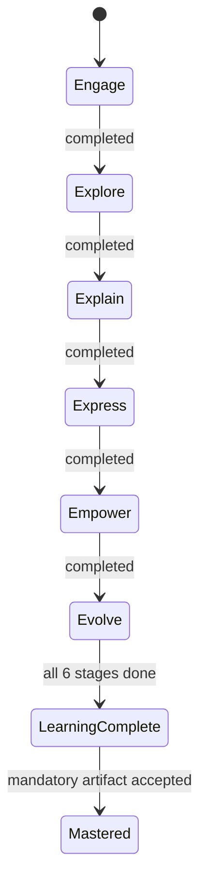
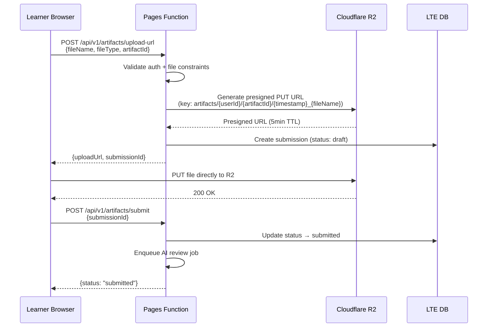
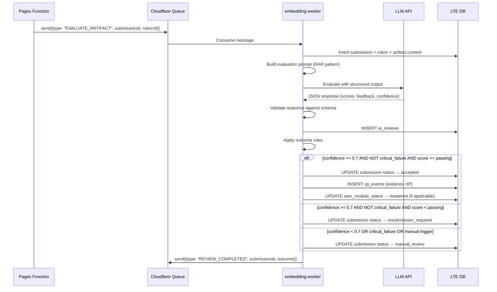
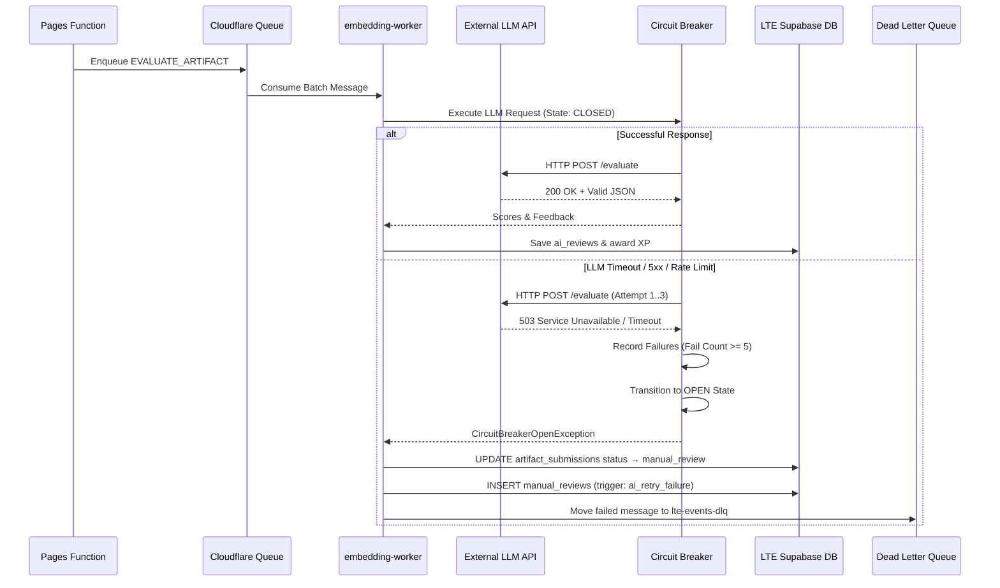

# LTE 3-Week MVP — Technical Requirements Document (TRD)

**Version**: 1.0  
**Status**: Draft for Technical Lead Review  
**Date**: 2026-07-24  
**Company**: Rareminds Pvt. Ltd.  
**Parent PRD**: [LTE_3_Week_MVP_PRD_v.1.md](file:///mnt/E230EB0F30EAEA0D/Rareminds/skill-echosystem/lte/LTE_3_Week_MVP_PRD_v.1.md)

---

| Field | Details |
|---|---|
| **Build Duration** | 3 weeks |
| **Platform** | Cloudflare Pages + Workers + Supabase PostgreSQL + R2 |
| **Frontend** | React 19 + Vite 8 + TailwindCSS 4 + Zustand + TanStack Query |
| **Backend** | Cloudflare Pages Functions (TypeScript) + SSO Worker (RPC) |
| **Auth** | `@rareminds-eym/auth-client` v1.0.12 + `@rareminds-eym/auth-core` v2.1.2 |
| **Database** | Supabase PostgreSQL (LTE DB) — separate from SkillPassport DB |
| **Artifact Storage** | Cloudflare R2 (presigned URL pattern) |
| **AI Provider** | Cloudflare Workers AI / External LLM API (configurable) |
| **Standards** | IEEE 730-2026, IEEE 9274.1.1-2023 (xAPI 2.0), DORA Elite, OWASP |

---

## Table of Contents

1. [Executive Summary](#1-executive-summary)
2. [System Architecture](#2-system-architecture)
3. [Cross-Ecosystem Integration Map](#3-cross-ecosystem-integration-map)
4. [Database Schema Design](#4-database-schema-design)
5. [API Specification](#5-api-specification)
6. [Frontend Architecture](#6-frontend-architecture)
7. [6E Learning Engine](#7-6e-learning-engine)
8. [Artifact Upload & Storage](#8-artifact-upload--storage)
9. [AI/Rubric Evaluation Pipeline](#9-airubric-evaluation-pipeline)
10. [XP Engine](#10-xp-engine)
11. [Readiness Calculator](#11-readiness-calculator)
12. [Marketplace Eligibility Gate](#12-marketplace-eligibility-gate)
13. [Event-Driven Architecture](#13-event-driven-architecture)
14. [Security & Compliance](#14-security--compliance)
15. [Performance & Scalability](#15-performance--scalability)
16. [Testing Strategy](#16-testing-strategy)
17. [Deployment & CI/CD](#17-deployment--cicd)
18. [Observability & Monitoring](#18-observability--monitoring)
19. [Error Handling & Resilience](#19-error-handling--resilience)
20. [Requirement Traceability Matrix](#20-requirement-traceability-matrix)
21. [Risk Register (Technical)](#21-risk-register-technical)
22. [Glossary](#22-glossary)
23. [3-Week Sprint Execution Plan](#23-3-week-sprint-execution-plan)
24. [Content Architecture & Seed Data Strategy](#24-content-architecture--seed-data-strategy)
25. [Learner Dashboard UX Specification](#25-learner-dashboard-ux-specification)
26. [Product Decisions Freeze Register](#26-product-decisions-freeze-register)
27. [Out-of-Scope Engineering Boundary](#27-out-of-scope-engineering-boundary)
28. [Updated Requirement Traceability Matrix (Complete)](#28-updated-requirement-traceability-matrix-complete)
29. [Cross-Ecosystem Alignment & Compatibility Matrix](#29-cross-ecosystem-alignment--compatibility-matrix)
30. [Architecture Decision Records (ADR Registry)](#30-architecture-decision-records-adr-registry)

---

## 1. Executive Summary

This TRD translates the [LTE 3-Week MVP PRD](file:///mnt/E230EB0F30EAEA0D/Rareminds/skill-echosystem/lte/LTE_3_Week_MVP_PRD_v.1.md) into implementable engineering specifications. The LTE is **not a traditional LMS** — it is a deterministic, role-readiness engine that transforms Skill Ecosystem assessment outputs into a learning execution journey with evidence-based mastery, XP allocation, readiness scoring, and marketplace eligibility.

### Design Principles

1. **Engine-First**: Build the deterministic pipeline (6E → Artifact → AI Review → XP → Readiness → Marketplace) before scaling content.
2. **Two-Database Split**: LTE DB owns learning catalog + learner progress. SkillPassport DB owns assessment data (RIASEC, aptitude, Big5, roles). Bridge via deterministic UUIDv5 shadow `roles` table.
3. **Reuse-First**: Reuse SSO Worker for auth, SkillPassport for assessment data, `@rareminds-eym/auth-*` packages for all auth flows.
4. **Immutable Evidence Trail**: Every XP event, artifact submission, AI review, and readiness calculation is append-only with version tracking.
5. **AI Recommends, System Decides**: AI generates evaluation scores and feedback; the system deterministically applies status, XP, readiness, and marketplace rules.

### 1.2 Non-Functional Requirements (NFR) Summary Matrix

| NFR Category | Technical Target / Threshold | Measurement / Standard | Enforcement Point |
|---|---|---|---|
| **Latency (API)** | p50 < 100ms, p95 < 500ms, p99 < 1000ms | Cloudflare Analytics / OpenTelemetry | Cloudflare Edge Pages Functions |
| **Latency (AI Review)** | Async completion < 60 seconds | Cloudflare Queue Consumer metrics | embedding-worker (Enhanced AI Worker) |
| **Throughput** | 500 concurrent API req/sec; 50 artifact uploads/sec | Load testing (k6/Artillery) | Cloudflare Edge auto-scaling |
| **Availability SLA** | 99.9% uptime (max 43.8 min downtime/month) | Synthetic monitoring (UptimeRobot) | Cloudflare Edge + Supabase Pro |
| **Scalability** | 100,000 active learners, zero-egress artifact storage | R2 storage, Hyperdrive pooling | Cloudflare R2 + Hyperdrive |
| **Security & Privacy** | OWASP Top 10, AES-256 at rest, TLS 1.3, RS256 JWT | Security linting, vulnerability scans | SSO Worker + Supabase RLS |
| **Maintainability** | Feature-Sliced Design (FSD), 80%+ test coverage | Vitest + @vitest/coverage-v8 | CI/CD Pipeline |

---

## 2. System Architecture

### 2.1 High-Level Architecture Diagram



### 2.2 Service Inventory

| Service | Type | Responsibility | Binding |
|---|---|---|---|
| **lte-app** | Cloudflare Pages | SPA + Pages Functions API | `SSO_SERVICE`, `R2_BUCKET`, `LTE_QUEUE` |
| **sso-api** | Cloudflare Worker | Authentication, JWT, session management | Service binding (RPC) |
| **embedding-worker** | Cloudflare Worker | AI rubric evaluation, LLM inference & vector embeddings (enhanced single worker) | Queue consumer, Hyperdrive |
| **LTE DB** | Supabase PostgreSQL | Learning catalog, learner progress, XP, readiness | Hyperdrive |
| **SkillPassport DB** | Supabase PostgreSQL | Industries, domains, roles, assessments | Read-only from LTE context |
| **R2 Bucket** | Cloudflare R2 | Learner artifact binary storage | R2 binding |

### 2.3 Wrangler Configuration (Target)

```toml
# wrangler.toml — LTE App
pages_build_output_dir = "dist"
name = "lte-app"
compatibility_date = "2026-07-24"
compatibility_flags = ["nodejs_compat"]

[[services]]
binding = "SSO_SERVICE"
service = "sso-api"
entrypoint = "SsoWorker"

[[r2_buckets]]
binding = "ARTIFACT_BUCKET"
bucket_name = "lte-artifacts"

[[queues.producers]]
binding = "LTE_QUEUE"
queue = "lte-events"

[[hyperdrive]]
binding = "LTE_DB"
id = "<HYPERDRIVE_ID>"

[vars]
ENVIRONMENT = "production"
COOKIE_DOMAIN = ".rareminds.in"
MAX_ARTIFACT_SIZE_MB = "50"
AI_CONFIDENCE_THRESHOLD = "0.7"
MAX_RESUBMISSIONS = "3"
```

### 2.4 Component Responsibility & RACI Matrix

| Component | Responsibility (R) | Accountable (A) | Consulted (C) | Informed (I) | Execution Runtime | Failover Behavior |
|---|---|---|---|---|---|---|
| **lte-frontend** | React 19 UI rendering, FSD state, StageGuard | Frontend Lead | Product Owner | QA / Delivery | Browser (SPA) | Local client error boundary + offline toast |
| **lte-functions** | Edge API endpoints (`/api/v1/*`), presigned URLs, input validation | Backend Lead | Tech Lead | QA | Cloudflare Pages Functions | HTTP 500 error response + structured log |
| **sso-api** | Auth verification, JWT issuance, session refresh | Security/Platform Lead | Tech Lead | Product | Cloudflare Worker (RPC) | Circuit breaker retry → HTTP 401 fallback |
| **embedding-worker** | Async queue consumer, LLM prompt execution, vector embeddings, structured scoring | AI Engineer | Tech Lead | L&D / Content | Cloudflare Worker | DLQ enqueue → status: `manual_review` |
| **LTE Supabase DB** | Catalog storage, learner stage/course status, XP events, readiness | Database Admin | Tech Lead | Security | PostgreSQL (Supabase) | Read-replica fallback / Hyperdrive pool retry |
| **Cloudflare R2** | Learner artifact binary file storage | Infrastructure Lead | Security Lead | QA | Cloudflare R2 | Presigned URL regeneration + chunk retry |
| **Cloudflare Queues** | Event bus between LTE Pages Functions and embedding-worker | Platform Lead | Tech Lead | QA | Cloudflare Queues | Retry 3x → Dead Letter Queue (`lte-events-dlq`) |

---

## 3. Cross-Ecosystem Integration Map

### 3.1 Data Ownership Contract



### 3.2 Integration Points

| Integration | Direction | Mechanism | Data |
|---|---|---|---|
| SSO → LTE | Inbound | Service Binding RPC | JWT claims, user profile, session |
| SkillPassport → LTE | Read-only | UUIDv5 shadow table | `role_family_roles.id` → `roles.id` |
| LTE → R2 | Outbound | R2 Binding + Presigned URLs | Artifact binary files |
| LTE → embedding-worker | Outbound | Cloudflare Queue | Artifact review & AI evaluation jobs |
| embedding-worker → LTE | Inbound | Direct DB write (Hyperdrive) | Review results & embeddings |
| LTE → Email Worker | Outbound | Queue (future) | Notifications (P2) |

---

## 4. Database Schema Design

### 4.1 Existing Catalog Tables (Already Migrated)

The following tables already exist in the LTE DB via migration [20260716092555_lte_learning_catalog.sql](file:///mnt/E230EB0F30EAEA0D/Rareminds/skill-echosystem/lte/supabase/migrations/20260716092555_lte_learning_catalog.sql):

| Table | Purpose | Key Constraints |
|---|---|---|
| `roles` | Shadow of SkillPassport `role_family_roles` | PK: id (UUIDv5 mirror), UQ: (role_name, role_family_name, domain_name) |
| `capabilities` | Reusable capability catalog | UQ: code |
| `level_scale` | L1–L5 proficiency levels | CHK: level_no BETWEEN 1 AND 5 |
| `role_capability_sequence` | Learning path per role context | UQ: (role_id, sequence_step), (role_id, capability_id) |
| `skills` | Reusable skill catalog | UQ: code |
| `courses` | One course per capability per level | UQ: course_code, (capability_id, level_id) |
| `course_skills` | Course ↔ Skill junction | UQ: (course_id, skill_id) |
| `modules` | Course modules | UQ: (course_id, module_no) |
| `modules_content` | 6E stages per module | UQ: (module_id, stage_name), CHK: stage_order 1–6 |
| `e_content` | Content items within 6E stages | Carries xp_reward |
| `module_artifacts` | Artifact requirements per 6E stage | CHK: total_score > 0 |
| `artifact_questions` | Questions within artifacts | UQ: (artifact_id, question_order) |
| `artifact_templates` | Downloadable templates | FK: artifact_id, question_id |

### 4.2 New Tables Required (User Progress Domain)

> [!IMPORTANT]
> All new tables follow the Expand-Migrate-Contract migration pattern per [04-database-api-standards.md](file:///home/gokul/.gemini/antigravity-ide/knowledge/kiro_steering_skill_echosystem/artifacts/04-database-api-standards.md). Each migration does ONE thing.

#### TRD-DB-001: `user_role_assignments`

Tracks which role a user is pursuing.

```sql
CREATE TABLE public.user_role_assignments (
  id              uuid DEFAULT gen_random_uuid() PRIMARY KEY,
  user_id         uuid NOT NULL REFERENCES public.users(id) ON DELETE CASCADE,
  role_id         uuid NOT NULL REFERENCES public.roles(id) ON DELETE RESTRICT,
  assignment_type varchar(20) NOT NULL CHECK (assignment_type IN ('self_selected', 'admin_assigned')),
  assigned_by     uuid REFERENCES public.users(id),  -- admin user_id if admin_assigned
  assignment_reason text,                  -- traceable reason for admin override
  is_active       boolean DEFAULT true NOT NULL,
  started_at      timestamptz DEFAULT now() NOT NULL,
  completed_at    timestamptz,
  created_at      timestamptz DEFAULT now() NOT NULL,
  updated_at      timestamptz DEFAULT now() NOT NULL,
  CONSTRAINT uq_user_role_active UNIQUE (user_id, role_id) WHERE is_active = true
);

CREATE INDEX idx_ura_user_id ON public.user_role_assignments(user_id);
CREATE INDEX idx_ura_role_id ON public.user_role_assignments(role_id);
```

#### TRD-DB-002: `user_stage_progress`

Tracks 6E stage completion per module per user.

```sql
CREATE TYPE public.stage_completion_status AS ENUM (
  'not_started', 'in_progress', 'completed'
);

CREATE TABLE public.user_stage_progress (
  id                uuid DEFAULT gen_random_uuid() PRIMARY KEY,
  user_id           uuid NOT NULL REFERENCES public.users(id) ON DELETE CASCADE,
  modules_content_id uuid NOT NULL REFERENCES public.modules_content(id) ON DELETE CASCADE,
  status            public.stage_completion_status DEFAULT 'not_started' NOT NULL,
  started_at        timestamptz,
  completed_at      timestamptz,
  time_spent_seconds integer DEFAULT 0 NOT NULL,
  created_at        timestamptz DEFAULT now() NOT NULL,
  updated_at        timestamptz DEFAULT now() NOT NULL,
  CONSTRAINT uq_user_stage UNIQUE (user_id, modules_content_id),
  CONSTRAINT chk_time_spent CHECK (time_spent_seconds >= 0)
);

CREATE INDEX idx_usp_user_module ON public.user_stage_progress(user_id, modules_content_id);
```

#### TRD-DB-003: `user_module_status`

Tracks learning-complete vs mastered per module per user.

```sql
CREATE TYPE public.module_mastery_status AS ENUM (
  'not_started', 'in_progress', 'learning_complete', 'mastered'
);

CREATE TABLE public.user_module_status (
  id              uuid DEFAULT gen_random_uuid() PRIMARY KEY,
  user_id         uuid NOT NULL REFERENCES public.users(id) ON DELETE CASCADE,
  module_id       uuid NOT NULL REFERENCES public.modules(id) ON DELETE CASCADE,
  status          public.module_mastery_status DEFAULT 'not_started' NOT NULL,
  stages_completed smallint DEFAULT 0 NOT NULL CHECK (stages_completed BETWEEN 0 AND 6),
  learning_completed_at timestamptz,
  mastered_at     timestamptz,
  created_at      timestamptz DEFAULT now() NOT NULL,
  updated_at      timestamptz DEFAULT now() NOT NULL,
  CONSTRAINT uq_user_module UNIQUE (user_id, module_id)
);
```

#### TRD-DB-004: `artifact_submissions`

Tracks user evidence submissions with full attempt history.

```sql
CREATE TYPE public.artifact_submission_status AS ENUM (
  'draft', 'submitted', 'under_review', 'resubmission_required',
  'manual_review', 'accepted'
);

CREATE TABLE public.artifact_submissions (
  id                uuid DEFAULT gen_random_uuid() PRIMARY KEY,
  user_id           uuid NOT NULL REFERENCES public.users(id) ON DELETE CASCADE,
  module_artifact_id uuid NOT NULL REFERENCES public.module_artifacts(id) ON DELETE RESTRICT,
  attempt_number    smallint NOT NULL CHECK (attempt_number >= 1),
  status            public.artifact_submission_status DEFAULT 'draft' NOT NULL,
  -- Storage references
  storage_key       varchar(500),          -- R2 object key
  storage_url       varchar(1000),         -- Public/signed URL
  file_name         varchar(255),
  file_type         varchar(100),
  file_size_bytes   bigint CHECK (file_size_bytes IS NULL OR file_size_bytes > 0),
  -- Text/link submissions
  text_content      text,
  link_url          varchar(1000),
  -- Metadata
  submitted_at      timestamptz,
  reviewed_at       timestamptz,
  metadata          jsonb DEFAULT '{}'::jsonb NOT NULL,
  created_at        timestamptz DEFAULT now() NOT NULL,
  updated_at        timestamptz DEFAULT now() NOT NULL,
  CONSTRAINT uq_submission_attempt UNIQUE (user_id, module_artifact_id, attempt_number),
  CONSTRAINT chk_has_content CHECK (
    storage_key IS NOT NULL OR text_content IS NOT NULL OR link_url IS NOT NULL
  )
);

CREATE INDEX idx_as_user_artifact ON public.artifact_submissions(user_id, module_artifact_id);
CREATE INDEX idx_as_status ON public.artifact_submissions(status);
CREATE INDEX idx_as_pending_review ON public.artifact_submissions(status)
  WHERE status IN ('submitted', 'under_review', 'manual_review');
```

#### TRD-DB-005: `ai_reviews`

Stores AI evaluation results. Immutable — one row per evaluation attempt.

```sql
CREATE TABLE public.ai_reviews (
  id                  uuid DEFAULT gen_random_uuid() PRIMARY KEY,
  submission_id       uuid NOT NULL REFERENCES public.artifact_submissions(id) ON DELETE RESTRICT,
  -- AI output
  overall_score       numeric(5,2) NOT NULL CHECK (overall_score BETWEEN 0 AND 100),
  criterion_scores    jsonb NOT NULL DEFAULT '[]'::jsonb,
  confidence          numeric(3,2) NOT NULL CHECK (confidence BETWEEN 0 AND 1),
  is_critical_failure boolean DEFAULT false NOT NULL,
  -- Feedback
  strengths           text[] DEFAULT '{}' NOT NULL,
  improvement_areas   text[] DEFAULT '{}' NOT NULL,
  evidence_found      text[] DEFAULT '{}' NOT NULL,
  evidence_missing    text[] DEFAULT '{}' NOT NULL,
  learner_feedback    text NOT NULL,        -- learner-safe summary
  resubmission_guidance text,
  -- Metadata
  rubric_version      integer NOT NULL,
  model_id            varchar(100) NOT NULL, -- AI model identifier
  prompt_version      varchar(50) NOT NULL,
  latency_ms          integer,
  raw_response        jsonb,                -- full AI response for audit
  created_at          timestamptz DEFAULT now() NOT NULL,
  CONSTRAINT chk_criterion_scores CHECK (jsonb_typeof(criterion_scores) = 'array')
);

CREATE INDEX idx_ar_submission_id ON public.ai_reviews(submission_id);
CREATE INDEX idx_ar_critical ON public.ai_reviews(is_critical_failure) WHERE is_critical_failure = true;
CREATE INDEX idx_ar_low_confidence ON public.ai_reviews(confidence) WHERE confidence < 0.7;
```

#### TRD-DB-006: `manual_reviews`

Tracks human review overrides.

```sql
CREATE TYPE public.manual_review_trigger AS ENUM (
  'low_confidence', 'unreadable', 'ambiguous', 'safety_concern',
  'ai_retry_failure', 'learner_dispute', 'two_failed_resubmissions'
);

CREATE TABLE public.manual_reviews (
  id              uuid DEFAULT gen_random_uuid() PRIMARY KEY,
  submission_id   uuid NOT NULL REFERENCES public.artifact_submissions(id) ON DELETE RESTRICT,
  reviewer_id     uuid NOT NULL REFERENCES public.users(id), -- faculty/mentor user_id
  trigger_reason  public.manual_review_trigger NOT NULL,
  override_score  numeric(5,2) CHECK (override_score IS NULL OR override_score BETWEEN 0 AND 100),
  reviewer_feedback text NOT NULL,
  decision        varchar(20) NOT NULL CHECK (decision IN ('accepted', 'resubmission_required')),
  ai_review_id    uuid REFERENCES public.ai_reviews(id), -- which AI review this overrides
  created_at      timestamptz DEFAULT now() NOT NULL
);

CREATE INDEX idx_mr_submission ON public.manual_reviews(submission_id);
```

#### TRD-DB-007: `xp_events`

Append-only XP ledger. Immutable after creation.

```sql
CREATE TYPE public.xp_category AS ENUM ('evidence', 'engagement');

CREATE TYPE public.xp_event_type AS ENUM (
  'stage_completed',           -- +1
  'practice_artifact_accepted', -- +2
  'final_artifact_accepted_1',  -- +20 (1st attempt)
  'final_artifact_accepted_2',  -- +15 (2nd attempt)
  'final_artifact_accepted_3',  -- +10 (3rd attempt)
  'manual_eval_accepted',       -- +5
  'course_completed_on_time',   -- +10
  'fast_track_capability',      -- +15
  'daily_login',                -- engagement only
  'profile_completed'           -- engagement only
);

CREATE TABLE public.xp_events (
  id              uuid DEFAULT gen_random_uuid() PRIMARY KEY,
  user_id         uuid NOT NULL REFERENCES public.users(id) ON DELETE CASCADE,
  event_type      public.xp_event_type NOT NULL,
  xp_category     public.xp_category NOT NULL,
  xp_amount       integer NOT NULL CHECK (xp_amount >= 0),
  -- Source references (polymorphic)
  source_type     varchar(50) NOT NULL,    -- 'stage', 'submission', 'course', 'capability', 'profile'
  source_id       uuid NOT NULL,           -- id of the source entity
  -- Deduplication
  idempotency_key varchar(200) NOT NULL,   -- e.g., "stage:{user_id}:{modules_content_id}"
  -- Audit
  metadata        jsonb DEFAULT '{}'::jsonb NOT NULL,
  created_at      timestamptz DEFAULT now() NOT NULL,
  CONSTRAINT uq_xp_idempotency UNIQUE (idempotency_key)
);

CREATE INDEX idx_xp_user ON public.xp_events(user_id);
CREATE INDEX idx_xp_user_category ON public.xp_events(user_id, xp_category);
CREATE INDEX idx_xp_user_evidence ON public.xp_events(user_id)
  WHERE xp_category = 'evidence';
```

#### TRD-DB-008: `readiness_snapshots`

Point-in-time readiness calculations. Immutable.

```sql
CREATE TABLE public.readiness_snapshots (
  id                    uuid DEFAULT gen_random_uuid() PRIMARY KEY,
  user_id               uuid NOT NULL REFERENCES public.users(id) ON DELETE CASCADE,
  role_id               uuid NOT NULL REFERENCES public.roles(id),
  -- Five-component breakdown
  course_completion_pct numeric(5,2) NOT NULL CHECK (course_completion_pct BETWEEN 0 AND 100),
  artifact_completion_pct numeric(5,2) NOT NULL CHECK (artifact_completion_pct BETWEEN 0 AND 100),
  ai_average_score      numeric(5,2) NOT NULL CHECK (ai_average_score BETWEEN 0 AND 100),
  xp_achievement_pct    numeric(5,2) NOT NULL CHECK (xp_achievement_pct BETWEEN 0 AND 100),
  profile_completion_pct numeric(5,2) NOT NULL CHECK (profile_completion_pct BETWEEN 0 AND 100),
  -- Weighted result
  readiness_score       numeric(5,2) NOT NULL CHECK (readiness_score BETWEEN 0 AND 100),
  readiness_band        varchar(30) NOT NULL CHECK (readiness_band IN (
    'Not Ready', 'Learning in Progress', 'Internship Ready', 'Job Ready'
  )),
  -- Context
  missing_evidence      text[] DEFAULT '{}' NOT NULL,
  config_warnings       text[] DEFAULT '{}' NOT NULL,
  improvement_actions   text[] DEFAULT '{}' NOT NULL,
  -- Metadata
  calculation_version   varchar(20) NOT NULL DEFAULT 'v1.0',
  calculated_at         timestamptz DEFAULT now() NOT NULL
);

CREATE INDEX idx_rs_user_role ON public.readiness_snapshots(user_id, role_id);
CREATE INDEX idx_rs_latest ON public.readiness_snapshots(user_id, role_id, calculated_at DESC);
```

#### TRD-DB-010: `user_course_status`

Tracks course-level completion, required for readiness formula ("Course Completion" component) and "course completed on time" XP award.

```sql
CREATE TYPE public.course_completion_status AS ENUM (
  'not_started', 'in_progress', 'completed'
);

CREATE TABLE public.user_course_status (
  id                uuid DEFAULT gen_random_uuid() PRIMARY KEY,
  user_id           uuid NOT NULL REFERENCES public.users(id) ON DELETE CASCADE,
  course_id         uuid NOT NULL REFERENCES public.courses(id) ON DELETE CASCADE,
  status            public.course_completion_status DEFAULT 'not_started' NOT NULL,
  modules_total     smallint NOT NULL CHECK (modules_total >= 0),
  modules_mastered  smallint DEFAULT 0 NOT NULL CHECK (modules_mastered >= 0),
  started_at        timestamptz,
  target_completion timestamptz,         -- for "on-time" XP calculation
  completed_at      timestamptz,
  created_at        timestamptz DEFAULT now() NOT NULL,
  updated_at        timestamptz DEFAULT now() NOT NULL,
  CONSTRAINT uq_user_course UNIQUE (user_id, course_id),
  CONSTRAINT chk_mastered_lte_total CHECK (modules_mastered <= modules_total)
);

CREATE INDEX idx_ucs_user ON public.user_course_status(user_id);
CREATE INDEX idx_ucs_status ON public.user_course_status(status);
```

#### TRD-DB-011: `user_assessment_links`

Stores per-user assessment-to-role context for FR2 ("Learner can view assessment-based tracks and role options"). This bridges the user's SkillPassport assessment result to their LTE role entry.

```sql
CREATE TABLE public.user_assessment_links (
  id                 uuid DEFAULT gen_random_uuid() PRIMARY KEY,
  user_id            uuid NOT NULL REFERENCES public.users(id) ON DELETE CASCADE,
  -- Assessment reference (from SkillPassport)
  assessment_type    varchar(50) NOT NULL CHECK (assessment_type IN (
    'riasec', 'aptitude', 'big5', 'three_track', 'combined'
  )),
  assessment_id      uuid,                 -- SkillPassport assessment ID (reference only, no FK)
  assessment_date    timestamptz,
  -- Recommended tracks/roles
  recommended_tracks jsonb NOT NULL DEFAULT '[]'::jsonb,  -- [{track, confidence, roles: [roleId]}]
  selected_role_id   uuid REFERENCES public.roles(id),    -- role user chose from recommendations
  -- Metadata
  report_url         varchar(1000),        -- link to 3-track report / AI report
  metadata           jsonb DEFAULT '{}'::jsonb NOT NULL,
  created_at         timestamptz DEFAULT now() NOT NULL,
  updated_at         timestamptz DEFAULT now() NOT NULL,
  CONSTRAINT uq_user_assessment UNIQUE (user_id, assessment_type)
);

CREATE INDEX idx_ual_user ON public.user_assessment_links(user_id);
```

#### TRD-DB-009: `marketplace_consent`

Versioned consent for marketplace visibility.

```sql
CREATE TABLE public.marketplace_consent (
  id              uuid DEFAULT gen_random_uuid() PRIMARY KEY,
  user_id         uuid NOT NULL REFERENCES public.users(id) ON DELETE CASCADE,
  consent_version varchar(20) NOT NULL,
  visibility_scope varchar(50)[] NOT NULL DEFAULT '{}', -- internship, job, project, recruiter
  consented_at    timestamptz NOT NULL,
  withdrawn_at    timestamptz,
  is_active       boolean DEFAULT true NOT NULL,
  metadata        jsonb DEFAULT '{}'::jsonb NOT NULL,
  created_at      timestamptz DEFAULT now() NOT NULL,
  updated_at      timestamptz DEFAULT now() NOT NULL,
  CONSTRAINT uq_consent_active UNIQUE (user_id) WHERE is_active = true
);

CREATE INDEX idx_mc_user ON public.marketplace_consent(user_id);
```

### 4.3 Row-Level Security Policy

All user-facing tables enforce RLS:

```sql
-- Pattern: Users can only read/write their own data
ALTER TABLE public.user_stage_progress ENABLE ROW LEVEL SECURITY;

CREATE POLICY user_own_data ON public.user_stage_progress
  FOR ALL USING (user_id = auth.uid())
  WITH CHECK (user_id = auth.uid());

-- Admin bypass via role check
CREATE POLICY admin_all_data ON public.user_stage_progress
  FOR ALL USING (
    EXISTS (SELECT 1 FROM auth.users WHERE id = auth.uid() AND raw_user_meta_data->>'role' = 'admin')
  );
```

> [!NOTE]
> Service-role key is used in Pages Functions (backend); RLS applies to direct Supabase client access. All Pages Functions API calls use `SUPABASE_SERVICE_ROLE_KEY` and handle authorization at the application layer via `@rareminds-eym/auth-core`.

---

## 5. API Specification

### 5.1 API Design Principles

- URL path versioning: `/api/v1/*`
- RESTful with consistent response format
- All endpoints authenticated via `@rareminds-eym/auth-core` middleware
- Pagination: default 50, max 1000
- Rate limiting: 100 req/min per user

### 5.2 Response Format

```typescript
// Success
{ "data": T, "meta"?: { pagination, timestamp } }

// Error (per 00-core-standards.md §5.2)
{
  "error": {
    "code": "VALIDATION_ERROR",
    "message": "Human-readable message",
    "requestId": "req_abc123",
    "timestamp": "2026-07-24T10:30:00Z"
  }
}
```

### 5.3 Endpoint Catalog

#### Authentication (Existing — Reuse)

| ID | Method | Path | Description | Auth |
|---|---|---|---|---|
| AUTH-001 | POST | `/api/v1/auth/sso/exchange` | SSO auth code exchange | Public |
| AUTH-002 | GET | `/api/v1/auth/me` | Get current user | JWT |
| AUTH-003 | POST | `/api/v1/auth/refresh` | Refresh access token | Cookie |
| AUTH-004 | POST | `/api/v1/auth/logout` | Clear session | JWT |

#### Roles & Roadmap

| ID | Method | Path | Description | Auth | PRD Ref |
|---|---|---|---|---|---|
| TRD-API-001 | GET | `/api/v1/roles` | List available roles (with tracks) | JWT | FR3 |
| TRD-API-002 | GET | `/api/v1/roles/:roleId` | Get role detail with capability sequence | JWT | FR4 |
| TRD-API-003 | POST | `/api/v1/learner/role-assignment` | Learner selects a role | JWT | FR3 |
| TRD-API-004 | POST | `/api/v1/admin/role-assignment` | Admin assigns role to learner | JWT+Admin | FR3 |
| TRD-API-005 | GET | `/api/v1/learner/roadmap` | Get 6-month roadmap for active role | JWT | FR4 |

#### Courses & Modules

| ID | Method | Path | Description | Auth | PRD Ref |
|---|---|---|---|---|---|
| TRD-API-006 | GET | `/api/v1/courses` | List courses for learner's role | JWT | FR5 |
| TRD-API-007 | GET | `/api/v1/courses/:courseId` | Course detail with modules | JWT | FR5 |
| TRD-API-008 | GET | `/api/v1/modules/:moduleId` | Module detail with 6E stages | JWT | FR6 |
| TRD-API-009 | GET | `/api/v1/modules/:moduleId/content/:stage` | Get 6E stage content | JWT | FR6 |

#### 6E Stage Progress

| ID | Method | Path | Description | Auth | PRD Ref |
|---|---|---|---|---|---|
| TRD-API-010 | POST | `/api/v1/progress/stage/start` | Mark stage as in_progress | JWT | FR6 |
| TRD-API-011 | POST | `/api/v1/progress/stage/complete` | Mark stage as completed | JWT | FR6 |
| TRD-API-012 | GET | `/api/v1/progress/module/:moduleId` | Get module progress | JWT | FR6 |

#### Artifact Submissions

| ID | Method | Path | Description | Auth | PRD Ref |
|---|---|---|---|---|---|
| TRD-API-013 | POST | `/api/v1/artifacts/upload-url` | Get presigned R2 upload URL | JWT | FR8 |
| TRD-API-014 | POST | `/api/v1/artifacts/submit` | Submit artifact for review | JWT | FR8 |
| TRD-API-015 | GET | `/api/v1/artifacts/:submissionId` | Get submission detail + review | JWT | FR8 |
| TRD-API-016 | GET | `/api/v1/artifacts/history` | Get submission history | JWT | FR8 |

#### AI/Manual Review

| ID | Method | Path | Description | Auth | PRD Ref |
|---|---|---|---|---|---|
| TRD-API-017 | GET | `/api/v1/reviews/:submissionId` | Get AI review result | JWT | FR9 |
| TRD-API-018 | POST | `/api/v1/admin/reviews/manual` | Submit manual review | JWT+Reviewer | FR9 |
| TRD-API-019 | GET | `/api/v1/admin/reviews/queue` | Manual review queue | JWT+Admin | FR14 |

#### XP & Readiness

| ID | Method | Path | Description | Auth | PRD Ref |
|---|---|---|---|---|---|
| TRD-API-020 | GET | `/api/v1/xp/summary` | Get XP breakdown (evidence + engagement) | JWT | FR10 |
| TRD-API-021 | GET | `/api/v1/xp/history` | Get XP event ledger | JWT | FR10 |
| TRD-API-022 | GET | `/api/v1/readiness` | Get latest readiness snapshot | JWT | FR12 |
| TRD-API-023 | POST | `/api/v1/readiness/calculate` | Trigger readiness recalculation | JWT | FR12 |

#### Dashboard & Marketplace

| ID | Method | Path | Description | Auth | PRD Ref |
|---|---|---|---|---|---|
| TRD-API-024 | GET | `/api/v1/dashboard` | Aggregated learner dashboard data | JWT | FR11 |
| TRD-API-025 | GET | `/api/v1/marketplace/eligibility` | Get marketplace eligibility status | JWT | FR13 |
| TRD-API-026 | POST | `/api/v1/marketplace/consent` | Grant marketplace visibility consent | JWT | FR13 |
| TRD-API-027 | DELETE | `/api/v1/marketplace/consent` | Withdraw consent | JWT | FR13 |

#### Admin

| ID | Method | Path | Description | Auth | PRD Ref |
|---|---|---|---|---|---|
| TRD-API-028 | GET | `/api/v1/admin/learners` | List learners with progress | JWT+Admin | FR14 |
| TRD-API-029 | GET | `/api/v1/admin/learners/:userId/progress` | Detailed learner progress | JWT+Admin | FR14 |
| TRD-API-030 | GET | `/api/v1/admin/analytics/overview` | MVP analytics dashboard | JWT+Admin | FR14 |

### 5.4 Key Endpoint Payload Specifications

#### 1. POST `/api/v1/artifacts/upload-url` (TRD-API-013)

**Request Payload:**
```json
{
  "module_artifact_id": "8f3b2a1c-4d5e-6f7a-8b9c-0d1e2f3a4b5c",
  "file_name": "capstone_project_v1.pdf",
  "file_type": "application/pdf",
  "file_size_bytes": 14285700
}
```

**Response Payload (200 OK):**
```json
{
  "data": {
    "submission_id": "7a6b5c4d-3e2f-1a0b-9c8d-7e6f5a4b3c2d",
    "upload_url": "https://lte-artifacts.r2.cloudflarestorage.com/artifacts/user_123/art_456/1784965200_capstone_project_v1.pdf?X-Amz-Algorithm=AWS4-HMAC-SHA256&...",
    "expires_at": "2026-07-25T10:36:24Z",
    "storage_key": "artifacts/user_123/art_456/1784965200_capstone_project_v1.pdf"
  }
}
```

#### 2. POST `/api/v1/artifacts/submit` (TRD-API-014)

**Request Payload:**
```json
{
  "submission_id": "7a6b5c4d-3e2f-1a0b-9c8d-7e6f5a4b3c2d",
  "module_artifact_id": "8f3b2a1c-4d5e-6f7a-8b9c-0d1e2f3a4b5c",
  "submission_type": "file"
}
```

**Response Payload (202 Accepted):**
```json
{
  "data": {
    "submission_id": "7a6b5c4d-3e2f-1a0b-9c8d-7e6f5a4b3c2d",
    "status": "submitted",
    "attempt_number": 1,
    "submitted_at": "2026-07-25T10:31:30Z",
    "review_status": "queued_for_ai"
  }
}
```

#### 3. GET `/api/v1/dashboard` (TRD-API-024)

**Response Payload (200 OK):**
```json
{
  "data": {
    "next_action": {
      "action": "submit_artifact",
      "label": "Submit evidence artifact for Data Engineering Module 2",
      "target_id": "8f3b2a1c-4d5e-6f7a-8b9c-0d1e2f3a4b5c"
    },
    "active_role": {
      "id": "c1a2b3c4-d5e6-7f8a-9b0c-1d2e3f4a5b6c",
      "name": "Senior Data Engineer",
      "family": "Data & AI",
      "domain": "Enterprise Software"
    },
    "progress_summary": {
      "courses_completed": 2,
      "courses_total": 6,
      "modules_mastered": 5,
      "modules_total": 18,
      "evidence_xp": 45,
      "engagement_xp": 12,
      "total_xp": 57
    },
    "readiness": {
      "score": 74,
      "band": "Internship Ready",
      "last_calculated": "2026-07-25T08:15:00Z"
    },
    "marketplace": {
      "eligible": true,
      "visible": true
    }
  }
}
```

---

## 6. Frontend Architecture

### 6.1 Feature-Sliced Design (FSD)

The LTE frontend follows [Feature-Sliced Design](file:///mnt/E230EB0F30EAEA0D/Rareminds/skill-echosystem/lte/docs/architecture/ARCHITECTURE.md) already established in the codebase:

```
src/
├── app/                    # App shell, providers, router, global styles
│   ├── providers/          # AuthProvider, QueryProvider, ThemeProvider
│   ├── router/             # Route definitions with guards
│   │   └── guards/         # AuthGuard, RoleGuard, StageGuard
│   └── styles/             # Global CSS, theme tokens
├── pages/                  # Route-level components
│   ├── LoginPage.tsx        # (Existing)
│   ├── DashboardPage.tsx    # TRD-FE-001: Learner dashboard
│   ├── RoadmapPage.tsx      # TRD-FE-002: 6-month roadmap
│   ├── CoursePage.tsx       # TRD-FE-003: Course detail with modules
│   ├── ModulePage.tsx       # TRD-FE-004: Module 6E stages
│   ├── ArtifactPage.tsx     # TRD-FE-005: Artifact submission
│   ├── ReviewPage.tsx       # TRD-FE-006: AI feedback view
│   ├── ReadinessPage.tsx    # TRD-FE-007: Readiness score + marketplace
│   └── admin/
│       ├── AdminDashboard.tsx    # TRD-FE-008
│       ├── ManualReviewPage.tsx  # TRD-FE-009
│       └── LearnerDetailPage.tsx # TRD-FE-010
├── features/               # Feature modules
│   ├── role-selection/      # Role selection/assignment flow
│   ├── six-e-engine/        # 6E stage sequencing logic
│   ├── artifact-upload/     # Upload flow with progress
│   ├── ai-review/           # Review display + resubmission
│   ├── xp-tracker/          # XP display + animations
│   └── readiness/           # Readiness calculator display
├── entities/                # Business domain entities
│   ├── course/              # (Existing)
│   ├── module/              # Module model + UI
│   ├── artifact/            # Artifact submission model
│   ├── review/              # AI review model
│   └── xp/                  # XP event model
├── shared/                  # (Existing) Reusable blocks
│   ├── api/                 # Supabase client, fetch helpers
│   ├── config/              # Environment config
│   ├── hooks/               # useAuth, useRole, useProgress
│   ├── lib/                 # Utilities
│   ├── schemas/             # Zod validation schemas
│   ├── store/               # Zustand stores
│   ├── types/               # TypeScript interfaces
│   └── ui/                  # Design system components
└── widgets/                 # Composed UI sections
    ├── ProgressBar/         # Multi-stage progress indicator
    ├── SixENavigator/       # 6E stage navigation with lock/unlock
    ├── XPCounter/           # Animated XP display
    ├── ReadinessGauge/      # Circular gauge + band indicator
    └── NextActionCard/      # "What to do next" CTA
```

### 6.2 State Management

| Store | Library | Scope |
|---|---|---|
| Auth | `@rareminds-eym/auth-client` (Zustand) | Global — session, user, tokens |
| Server Cache | TanStack Query | All API data — courses, progress, reviews |
| UI State | Zustand | Page-level transient state (modals, forms) |

### 6.3 Route Guards

```typescript
// 6E Stage Guard: Enforce sequential stage progression
const StageGuard: FC = ({ children }) => {
  const { currentStage, completedStages } = useModuleProgress();
  const requestedStage = useParams().stage;
  
  // PRD Rule: No stage may be skipped in MVP (FR6)
  const stageOrder = ['engage', 'explore', 'explain', 'express', 'empower', 'evolve'];
  const requestedIndex = stageOrder.indexOf(requestedStage);
  const lastCompletedIndex = Math.max(...completedStages.map(s => stageOrder.indexOf(s)), -1);
  
  if (requestedIndex > lastCompletedIndex + 1) {
    return <Navigate to={`/module/${moduleId}/stage/${stageOrder[lastCompletedIndex + 1]}`} />;
  }
  
  return children;
};
```

---

## 7. 6E Learning Engine

### 7.1 Stage Sequencing Rules



### 7.2 Technical Implementation

| Rule | Implementation | Enforcement |
|---|---|---|
| **No stage skipping** | `StageGuard` component + API validation | Frontend guard + backend check on stage_complete |
| **Sequential only** | `stage_order` column in `modules_content` | API returns 403 if prerequisite stage not completed |
| **Learning-complete ≠ Mastered** | Separate `module_mastery_status` enum | Status transitions enforced in `user_module_status` |
| **XP per stage** | +1 evidence XP on stage completion | Idempotency key prevents duplicate awards |

### 7.3 Stage Completion API Logic

```typescript
// POST /api/v1/progress/stage/complete
async function completeStage(req: AuthenticatedRequest, env: Env) {
  const { modules_content_id } = req.body;
  const user_id = req.user.id;
  
  // 1. Verify prerequisite stage is completed
  const stage = await getStage(env, modules_content_id);
  if (stage.stage_order > 1) {
    const prevStage = await getPreviousStage(env, stage.module_id, stage.stage_order - 1);
    const prevProgress = await getStageProgress(env, user_id, prevStage.id);
    if (prevProgress?.status !== 'completed') {
      return errorResponse('PREREQUISITE_INCOMPLETE', 'Previous stage must be completed first', 403);
    }
  }
  
  // 2. Mark stage as completed (idempotent)
  await upsertStageProgress(env, user_id, modules_content_id, 'completed');
  
  // 3. Award XP (idempotent via idempotency_key)
  const idempotencyKey = `stage:${user_id}:${modules_content_id}`;
  await awardXP(env, {
    user_id, event_type: 'stage_completed', xp_category: 'evidence',
    xp_amount: 1, source_type: 'stage', source_id: modules_content_id,
    idempotency_key: idempotencyKey
  });
  
  // 4. Check if all 6 stages are now completed → update module status
  const allStages = await getAllStageProgress(env, user_id, stage.module_id);
  if (allStages.filter(s => s.status === 'completed').length === 6) {
    await updateModuleStatus(env, user_id, stage.module_id, 'learning_complete');
  }
  
  // 5. Emit event
  await env.LTE_QUEUE.send({ type: 'STAGE_COMPLETED', user_id, modules_content_id });
  
  return successResponse({ status: 'completed' });
}
```

---

## 8. Artifact Upload & Storage

### 8.1 Upload Flow (Presigned URL Pattern)



### 8.2 File Constraints

| Constraint | Value | Enforcement |
|---|---|---|
| Max file size | 50 MB | R2 presigned URL content-length condition |
| Allowed MIME types | PDF, DOC/DOCX, PPT/PPTX, XLS/XLSX, JPEG, PNG, ZIP | Validated in upload-url endpoint |
| Max attempts per artifact | 3 (then manual review) | `attempt_number` check in submit endpoint |
| R2 key pattern | `artifacts/{userId}/{artifactId}/{timestamp}_{fileName}` | Server-generated, not client-controlled |

### 8.3 Text/Link Submissions

For non-file submissions (text responses, Google Drive links, code links):

```typescript
// POST /api/v1/artifacts/submit
{
  module_artifact_id: "uuid",
  submission_type: "text" | "link" | "file",
  text_content?: "string",        // for text submissions
  link_url?: "https://...",       // for link submissions  
  submission_id?: "uuid"          // for file submissions (from upload-url flow)
}
```

---

## 9. AI/Rubric Evaluation Pipeline

### 9.1 Pipeline Architecture



### 9.2 Prompt Engineering Specification

```typescript
interface EvaluationPrompt {
  system: string;     // Role: "You are an expert educational evaluator..."
  rubric: {           // Retrieved from DB — not hardcoded
    criteria: Array<{
      name: string;
      description: string;
      weight: number;
      scoring_anchors: Record<number, string>; // 1-5 level descriptions
    }>;
    total_score: number;
    passing_score: number;
  };
  artifact: {
    type: string;
    content: string;  // Extracted text or link
    context: string;  // Problem statement + expected output
  };
  instructions: string; // Chain-of-thought + output schema
}
```

### 9.3 Structured AI Output Schema

```typescript
const AIReviewOutputSchema = z.object({
  overall_score: z.number().min(0).max(100),
  criterion_scores: z.array(z.object({
    criterion_name: z.string(),
    score: z.number().min(0).max(100),
    evidence_found: z.string(),
    evidence_missing: z.string().optional(),
  })),
  confidence: z.number().min(0).max(1),
  is_critical_failure: z.boolean(),
  critical_failure_reason: z.string().optional(),
  strengths: z.array(z.string()),
  improvement_areas: z.array(z.string()),
  learner_feedback: z.string(),             // learner-safe language
  resubmission_guidance: z.string().optional(),
});
```

### 9.4 Manual Review Triggers

Per PRD §10.2, manual review is **mandatory** when:

| Trigger | Detection | Action |
|---|---|---|
| Low confidence | `confidence < AI_CONFIDENCE_THRESHOLD` (0.7) | Status → `manual_review` |
| Unreadable artifact | AI returns `is_critical_failure: true` with reason | Status → `manual_review` |
| Ambiguous interpretation | AI returns `confidence < 0.5` | Status → `manual_review` |
| Safety/compliance concern | AI flags safety in `critical_failure_reason` | Status → `manual_review` + alert |
| AI retry failure | Queue consumer fails 3 times | Status → `manual_review` |
| Learner dispute | Learner raises dispute (future P1) | Status → `manual_review` |
| Two failed resubmissions | `attempt_number >= 3` with no acceptance | Status → `manual_review` |

### 9.5 Production RAR (Retrieval-Augmented Reasoning) LLM Prompt Template

The enhanced `embedding-worker` uses the following exact structured prompt template when sending evaluation jobs to the LLM API:

```text
[SYSTEM PROMPT]
You are an objective, rigorous industrial educational evaluator for Rareminds LTE.
Your job is to evaluate a learner's artifact submission strictly against the provided rubric.

CRITICAL EVALUATION RULES:
1. Do not hallucinate scores or evidence. If evidence for a criterion is missing from the artifact, explicitly mark score as 0 for that criterion and list it under 'evidence_missing'.
2. Return ONLY a valid JSON object matching the JSON Schema provided. Do not include markdown commentary or preamble outside the JSON object.
3. Calculate 'overall_score' as the weighted sum of individual criterion scores (scaled 0 to 100).
4. Provide constructive, learner-safe feedback in 'learner_feedback'. Avoid discouraging or vague language.
5. Provide actionable guidance under 'resubmission_guidance' if overall_score is below passing threshold.

[RUBRIC CONTEXT]
Rubric ID: {rubric_id} (Version {rubric_version})
Passing Threshold: {passing_score} / 100
Criteria:
{rubric_criteria_json}

[PROBLEM STATEMENT]
{problem_statement}

[LEARNER SUBMISSION]
Artifact Type: {submission_type}
Content / Extracted Text:
"""
{artifact_extracted_content}
"""

[OUTPUT JSON SCHEMA]
{
  "overall_score": number (0-100),
  "criterion_scores": [
    {
      "criterion_name": string,
      "score": number (0-100),
      "evidence_found": string,
      "evidence_missing": string
    }
  ],
  "confidence": number (0.0-1.0),
  "is_critical_failure": boolean,
  "critical_failure_reason": string,
  "strengths": [string],
  "improvement_areas": [string],
  "learner_feedback": string,
  "resubmission_guidance": string
}
```

---

## 10. XP Engine

### 10.1 XP Allocation Rules

| Event | XP | Category | Readiness Impact | Idempotency Key Pattern |
|---|---|---|---|---|
| 6E stage completed | +1 | evidence | ✅ Yes | `stage:{userId}:{modulesContentId}` |
| Practice artifact accepted | +2 | evidence | ✅ Yes | `practice:{userId}:{submissionId}` |
| Final artifact accepted (attempt 1) | +20 | evidence | ✅ Yes | `final:{userId}:{moduleArtifactId}` |
| Final artifact accepted (attempt 2) | +15 | evidence | ✅ Yes | `final:{userId}:{moduleArtifactId}` |
| Final artifact accepted (attempt 3) | +10 | evidence | ✅ Yes | `final:{userId}:{moduleArtifactId}` |
| Manual evaluation accepted | +5 | evidence | ✅ Yes | `manual:{userId}:{submissionId}` |
| Course completed on time | +10 | evidence | ✅ Yes | `course:{userId}:{courseId}` |
| Fast-track capability | +15 | evidence | ✅ Yes | `fasttrack:{userId}:{capabilityId}` |
| Daily login | +1 | engagement | ❌ No | `login:{userId}:{date}` |
| Profile completed | +5 | engagement | ❌ No | `profile:{userId}` |

### 10.2 Critical Invariants

> [!CAUTION]
> **MANDATORY**: These invariants must be enforced at the database level AND application level:

1. **Failed artifacts receive 0 XP** — No XP row is inserted for failed/incomplete/resubmission-required submissions.
2. **No duplicate XP** — The `idempotency_key` UNIQUE constraint prevents double-awarding.
3. **Engagement XP ≠ Readiness** — `xp_category = 'engagement'` is excluded from readiness calculation.
4. **Revisiting content does not award XP** — Idempotency key tied to entity, not to timestamp.

### 10.3 XP Summary Query

```sql
-- Evidence XP (contributes to readiness)
SELECT COALESCE(SUM(xp_amount), 0) as evidence_xp
FROM xp_events
WHERE user_id = $1 AND xp_category = 'evidence';

-- Engagement XP (motivation only)
SELECT COALESCE(SUM(xp_amount), 0) as engagement_xp
FROM xp_events
WHERE user_id = $1 AND xp_category = 'engagement';

-- Total XP
SELECT COALESCE(SUM(xp_amount), 0) as total_xp
FROM xp_events
WHERE user_id = $1;
```

---

## 11. Readiness Calculator

### 11.1 Formula Implementation

```typescript
interface ReadinessComponents {
  courseCompletion: number;     // 30% weight
  artifactCompletion: number;  // 25% weight
  aiAverageScore: number;      // 25% weight
  xpAchievement: number;       // 10% weight
  profileCompletion: number;   // 10% weight
}

function calculateReadiness(components: ReadinessComponents): number {
  return Math.round(
    components.courseCompletion * 0.30 +
    components.artifactCompletion * 0.25 +
    components.aiAverageScore * 0.25 +
    components.xpAchievement * 0.10 +
    components.profileCompletion * 0.10
  );
}

function getReadinessBand(score: number): string {
  if (score >= 80) return 'Job Ready';
  if (score >= 60) return 'Internship Ready';
  if (score >= 40) return 'Learning in Progress';
  return 'Not Ready';
}
```

### 11.2 Component Calculations

| Component | Calculation | Missing-Score Rule |
|---|---|---|
| Course Completion (30%) | `(mastered_modules / required_modules) * 100` | 0 if no modules mastered |
| Artifact Completion (25%) | `(accepted_mandatory_artifacts / required_mandatory_artifacts) * 100` | 0 if no artifacts submitted |
| AI Average Score (25%) | `AVG(overall_score) FROM ai_reviews WHERE submission.status = 'accepted'` | 0 if no accepted AI scores |
| XP Achievement (10%) | `MIN(evidence_xp_earned / expected_evidence_xp * 100, 100)` | 0 if no expected XP configured (+ warning) |
| Profile Completion (10%) | `completed_required_fields / total_required_fields * 100` | Use actual percentage |

### 11.3 Recalculation Triggers

Readiness is recalculated (new snapshot created) on:
- Artifact accepted
- Module mastered
- Course completed
- Manual review resolved
- Profile updated (required fields)
- Explicit recalculation request

### 11.4 Readiness Display Specification (PRD §12.4)

> [!IMPORTANT]
> The dashboard must show **more than a score**. Per PRD §12.4, the readiness display requires ALL of the following:

| Field | Source | Format |
|---|---|---|
| **Readiness Score** | `readiness_snapshots.readiness_score` | Whole-number (no decimals — avoid false precision) |
| **Readiness Band** | `readiness_snapshots.readiness_band` | "Not Ready" / "Learning in Progress" / "Internship Ready" / "Job Ready" |
| **Last Calculated Date** | `readiness_snapshots.calculated_at` | Relative ("2 hours ago") + absolute tooltip |
| **Current Role/Path** | `user_role_assignments` → `roles` | Role name + domain + role family |
| **Missing Evidence** | `readiness_snapshots.missing_evidence` | List of unmet requirements (e.g., "Module 3 artifact not submitted") |
| **Configuration Warnings** | `readiness_snapshots.config_warnings` | Warnings for missing config (e.g., "Expected XP target not configured") |
| **Improvement Actions** | `readiness_snapshots.improvement_actions` | Ordered list of what improves the score most (e.g., "Submit artifact for Module 2 → +8 points") |
| **Component Breakdown** | Five individual percentages | Visual bar chart showing each component vs. its weight |

```typescript
// Dashboard readiness response shape
interface ReadinessDisplay {
  score: number;                    // whole number, no decimals
  band: string;
  lastCalculated: string;           // ISO 8601
  currentRole: { name: string; domain: string; family: string };
  components: {
    courseCompletion: { value: number; weight: 30 };
    artifactCompletion: { value: number; weight: 25 };
    aiAverageScore: { value: number; weight: 25 };
    xpAchievement: { value: number; weight: 10 };
    profileCompletion: { value: number; weight: 10 };
  };
  missingEvidence: string[];
  configWarnings: string[];
  improvementActions: string[];     // ordered by impact
}
```

### 11.5 Worked Mathematical Calculation Example

Below is a step-by-step mathematical evaluation of a sample learner to demonstrate how raw progress data converts into a readiness score:

#### Learner Progress State
- **Modules Mastered**: 2 out of 4 required modules ($50.0\%$)
- **Artifacts Accepted**: 1 out of 1 mandatory artifact submitted so far ($100.0\%$)
- **Accepted AI Review Scores**: Single accepted submission with score **85.0 / 100.0**
- **Evidence XP Earned**: 25 XP out of target 50 Evidence XP ($50.0\%$)
- **Profile Completion**: 8 out of 10 required fields filled ($80.0\%$)

#### Weighted Calculation Step

$$\text{Course Score} = 50.0 \times 0.30 = 15.00$$
$$\text{Artifact Score} = 100.0 \times 0.25 = 25.00$$
$$\text{AI Score} = 85.0 \times 0.25 = 21.25$$
$$\text{XP Score} = 50.0 \times 0.10 = 5.00$$
$$\text{Profile Score} = 80.0 \times 0.10 = 8.00$$

$$\text{Raw Readiness Score} = 15.00 + 25.00 + 21.25 + 5.00 + 8.00 = \mathbf{74.25}$$

$$\text{Final Rounded Score} = \text{Math.round}(74.25) = \mathbf{74}$$

#### Evaluated Readiness Result
- **Readiness Score**: **74**
- **Readiness Band**: **Internship Ready** ($60 \le \text{Score} < 80$)
- **Next High-Impact Action**: Master Module 3 to gain $+7.5$ score points ($50\% \rightarrow 75\%$ course completion).

---

## 12. Marketplace Eligibility Gate

### 12.1 Eligibility Check Logic

```typescript
interface EligibilityResult {
  eligible: boolean;
  visible: boolean;
  blocking_reasons: string[];
  readiness_band: string;
  readiness_score: number;
}

function checkEligibility(learner: LearnerData): EligibilityResult {
  const blocks: string[] = [];
  
  // Mandatory conditions (PRD §12.5)
  if (!learner.target_role_id) blocks.push('No target role assigned');
  if (!learner.mandatory_profile_complete) blocks.push('Mandatory profile fields incomplete');
  if (learner.accepted_artifact_count === 0) blocks.push('No accepted artifacts');
  if (learner.has_unresolved_critical_failure) blocks.push('Unresolved critical failure evaluation');
  if (!learner.account_active) blocks.push('Account is not active');
  
  const eligible = blocks.length === 0;
  
  // Visibility requires eligibility + active consent
  const hasConsent = learner.consent?.is_active &&
    learner.consent?.consent_version === CURRENT_CONSENT_VERSION;
  
  if (eligible && !hasConsent) {
    blocks.push('Marketplace visibility consent not granted or version mismatch');
  }
  
  return {
    eligible,
    visible: eligible && hasConsent,
    blocking_reasons: blocks,
    readiness_band: learner.readiness_band,
    readiness_score: learner.readiness_score,
  };
}
```

---

## 13. Event-Driven Architecture

### 13.1 Domain Events

Per [03-event-driven-architecture.md](file:///home/gokul/.gemini/antigravity-ide/knowledge/kiro_steering_skill_echosystem/artifacts/03-event-driven-architecture.md), events are immutable facts:

| Event Type | Payload | Producer | Consumers |
|---|---|---|---|
| `STAGE_COMPLETED` | `{userId, modulesContentId, stageOrder}` | Stage progress API | XP Engine |
| `ARTIFACT_SUBMITTED` | `{userId, submissionId, artifactId}` | Artifact submit API | embedding-worker |
| `REVIEW_COMPLETED` | `{submissionId, outcome, score, xpAwarded}` | embedding-worker | Readiness Calculator, Dashboard |
| `MODULE_MASTERED` | `{userId, moduleId, courseId}` | Review pipeline | Readiness Calculator |
| `READINESS_RECALCULATED` | `{userId, roleId, score, band}` | Readiness Calculator | Dashboard, Marketplace |
| `CONSENT_GRANTED` | `{userId, version, scope}` | Consent API | Marketplace |
| `CONSENT_WITHDRAWN` | `{userId}` | Consent API | Marketplace |

### 13.2 Queue Configuration

```toml
# Cloudflare Queue
[[queues.producers]]
binding = "LTE_QUEUE"
queue = "lte-events"

[[queues.consumers]]
queue = "lte-events"
max_batch_size = 10
max_batch_timeout = 5        # seconds
max_retries = 3
dead_letter_queue = "lte-events-dlq"
```

### 13.3 xAPI 2.0 (IEEE 9274.1.1-2023) Event Statement Specification

All domain events emitted to `lte-events` queue conform to IEEE 9274.1.1-2023 (xAPI 2.0) standard statements for auditability and ecosystem interoperability:

```json
{
  "id": "e4d3c2b1-a09b-8c7d-6e5f-4a3b2c1d0e9f",
  "actor": {
    "objectType": "Agent",
    "account": {
      "homePage": "https://sso.rareminds.in",
      "name": "usr_9876543210"
    }
  },
  "verb": {
    "id": "http://adlnet.gov/expapi/verbs/completed",
    "display": { "en-US": "completed" }
  },
  "object": {
    "objectType": "Activity",
    "id": "https://lte.rareminds.in/activities/module-content/mc_12345",
    "definition": {
      "name": { "en-US": "Express Stage — Data Engineering Capstone" },
      "type": "http://adlnet.gov/expapi/activities/module"
    }
  },
  "result": {
    "completion": true,
    "success": true,
    "score": { "scaled": 0.85, "raw": 85, "min": 0, "max": 100 },
    "duration": "PT45M"
  },
  "timestamp": "2026-07-25T10:35:00Z"
}
```

---

## 14. Security & Compliance

Per [01-security-compliance.md](file:///home/gokul/.gemini/antigravity-ide/knowledge/kiro_steering_skill_echosystem/artifacts/01-security-compliance.md):

### 14.1 Authentication

| Requirement | Implementation |
|---|---|
| Auth packages | `@rareminds-eym/auth-client` v1.0.12 (frontend), `@rareminds-eym/auth-core` v2.1.2 (backend) |
| Token storage | Access token: in-memory only. Refresh token: HttpOnly, Secure, SameSite cookie |
| Session timeout | 15 min access token, 7 day refresh token |
| Auth flow | SSO Worker RPC via service binding — zero HTTP overhead |

### 14.2 Authorization (RBAC)

| Role | Permissions |
|---|---|
| `learner` | Own progress, own submissions, own XP, own readiness, own consent |
| `reviewer` / `mentor` | Manual review queue, review submissions assigned to them |
| `admin` | All learner data, role assignments, analytics, content management |

### 14.3 Data Protection

| Data | Classification | Protection |
|---|---|---|
| Learner artifacts | PII-adjacent (may contain personal work) | R2 encryption at rest, presigned URL access only |
| AI review results | Sensitive | RLS, audit trail, no PII in logs |
| XP events | Internal | Append-only, immutable |
| Marketplace consent | PII (GDPR consent record) | Versioned, timestamped, withdrawal preserves history |
| AI raw responses | Internal/Debug | Stored in `ai_reviews.raw_response`, excluded from learner API |

### 14.4 Input Validation

All API inputs validated with Zod schemas (server-side, per OWASP):

```typescript
// Example: Artifact submission validation
const SubmitArtifactSchema = z.object({
  module_artifact_id: z.string().uuid(),
  submission_type: z.enum(['file', 'text', 'link']),
  text_content: z.string().max(50000).optional(),
  link_url: z.string().url().max(1000).optional(),
  submission_id: z.string().uuid().optional(), // for file submissions
}).refine(data => {
  if (data.submission_type === 'text') return !!data.text_content;
  if (data.submission_type === 'link') return !!data.link_url;
  if (data.submission_type === 'file') return !!data.submission_id;
  return false;
}, { message: 'Content required for submission type' });
```

---

## 15. Performance & Scalability

Per [00-core-standards.md](file:///home/gokul/.gemini/antigravity-ide/knowledge/kiro_steering_skill_echosystem/artifacts/00-core-standards.md) §3:

### 15.1 Performance Targets

| Metric | Target | Measurement |
|---|---|---|
| API p50 | < 100ms | Cloudflare analytics |
| API p95 | < 500ms | Cloudflare analytics |
| API p99 | < 1000ms | Cloudflare analytics |
| FCP | < 1.8s | Lighthouse |
| LCP | < 2.5s | Lighthouse |
| TTI | < 3.8s | Lighthouse |
| CLS | < 0.1 | Lighthouse |
| DB queries (simple) | < 10ms | Hyperdrive metrics |
| DB queries (complex) | < 100ms | Hyperdrive metrics |
| Artifact upload (50MB) | < 30s | R2 direct upload |
| AI evaluation latency | < 60s | Queue consumer metrics |

### 15.2 Scalability Design

| Concern | Strategy |
|---|---|
| API scaling | Cloudflare Workers: auto-scales globally at edge |
| DB connection pooling | Hyperdrive: managed connection pool |
| Artifact storage | R2: S3-compatible, unlimited scale, zero egress |
| AI evaluation | Queue-based: decoupled from request path, configurable batch size |
| Frontend caching | TanStack Query: stale-while-revalidate, cache invalidation on mutations |

### 15.3 Pagination

All list endpoints use cursor-based or offset pagination:

```typescript
const PaginationSchema = z.object({
  page: z.coerce.number().int().min(1).default(1),
  page_size: z.coerce.number().int().min(1).max(1000).default(50),
});
```

---

## 16. Testing Strategy

### 16.1 Coverage Targets

| Type | Coverage Target | Focus Areas |
|---|---|---|
| Unit Tests | 80%+ | XP engine rules, readiness formula, eligibility gate, stage sequencing |
| Integration Tests | Critical paths | API endpoints, DB queries, queue consumer |
| E2E Tests | Full learner loop | Login → role → course → 6E → artifact → review → XP → readiness |
| Property Tests | Invariants | "Failed artifacts never produce XP", "Readiness never exceeds 100" |

### 16.2 Critical Test Cases

| ID | Test | Type | PRD Ref |
|---|---|---|---|
| T-001 | No 6E stage skipping | Unit + E2E | FR6 |
| T-002 | No learning-complete without all 6 stages | Unit | FR15 |
| T-003 | No mastered without accepted artifact | Unit | FR15 |
| T-004 | Failed artifact receives 0 XP | Unit | §11.2 |
| T-005 | No duplicate XP for same event | Unit | §11.3 |
| T-006 | Readiness excludes engagement XP | Unit | §12.1 |
| T-007 | Critical failure overrides numeric score | Unit | §10.2 |
| T-008 | Manual review triggered at low confidence | Integration | §10.2 |
| T-009 | Marketplace blocked without consent | Unit | §12.5 |
| T-010 | Consent withdrawal stops visibility | Unit | §16 |
| T-011 | Governance changes don't mutate completed outcomes | Integration | FR16 |
| T-012 | Full learner loop end-to-end | E2E | §4 |

### 16.3 Tools

| Tool | Purpose |
|---|---|
| Vitest | Unit + integration tests |
| Playwright | E2E tests |
| @vitest/coverage-v8 | Coverage reporting |
| Testing Library | Component tests |

---

## 17. Deployment & CI/CD

### 17.1 Environment Strategy

| Environment | Purpose | URL Pattern |
|---|---|---|
| Development | Local dev with Wrangler | `localhost:3000` (Vite) + `localhost:8789` (Pages) |
| Staging | Pre-production validation | `lte-staging.rareminds.in` |
| Production | Live | `lte.rareminds.in` |

### 17.2 CI Pipeline

```yaml
# .github/workflows/ci.yml
steps:
  - lint:files        # Validate file types
  - lint:console      # No console.log in production code
  - lint:lengths      # File length limits
  - lint:biome        # Biome formatting
  - lint:secrets      # No secrets in code
  - lint (eslint)     # ESLint + Stylelint
  - typecheck         # tsc --noEmit
  - test (vitest)     # Unit + integration tests (80%+ coverage)
  - build             # Vite production build
  - deploy:staging    # Wrangler Pages deploy (staging)
  - e2e:staging       # Playwright E2E on staging
  - deploy:production # Wrangler Pages deploy (production) — manual gate
```

### 17.3 Deployment Checklist

Per [05-production-readiness.md](file:///home/gokul/.gemini/antigravity-ide/knowledge/kiro_steering_skill_echosystem/artifacts/05-production-readiness.md):

- [ ] All tests passing (unit, integration, E2E)
- [ ] Coverage ≥ 80%
- [ ] Security scan passed
- [ ] Performance benchmarks met (p95 < 500ms)
- [ ] Secrets configured via `wrangler secret put`
- [ ] R2 bucket created and bound
- [ ] Hyperdrive configured for LTE DB
- [ ] Queue created and consumer deployed
- [ ] Observability enabled in `wrangler.toml`
- [ ] Health check endpoint implemented
- [ ] Database migrations applied (backward compatible)
- [ ] CORS configured for production domain

---

## 18. Observability & Monitoring

### 18.1 Structured Logging

```typescript
// Per 02-cloudflare-platform.md §7.8
const log = (level: string, message: string, data: Record<string, unknown>) => {
  console[level === 'error' ? 'error' : 'log'](JSON.stringify({
    level, message, service: 'lte-app',
    timestamp: new Date().toISOString(),
    requestId: data.requestId,
    userId: data.userId,
    ...data,
  }));
};
```

### 18.2 Health Check

```typescript
// GET /api/v1/health
{
  status: "healthy" | "degraded",
  service: "lte-app",
  version: "0.1.0",
  timestamp: "2026-07-24T10:30:00Z",
  checks: {
    database: true,
    sso_service: true,
    r2_bucket: true,
    queue: true
  }
}
```

### 18.3 Key Metrics

| Metric | Alert Threshold |
|---|---|
| API error rate | > 1% |
| API p99 latency | > 2s |
| AI evaluation queue depth | > 100 pending |
| AI evaluation failure rate | > 5% |
| Health check failure | Any component |
| XP idempotency collisions | > 0 (unexpected) |

---

## 19. Error Handling, Resilience & Failure Architecture

### 19.1 Failure & Recovery Architecture Diagrams

#### AI Evaluation Pipeline Failure & Recovery Flow



#### System Degraded Mode Navigation Flow

```mermaid
flowchart TD
    A[Learner Action] --> B{Component Availability Check}
    
    B -->|SSO Worker RPC Unreachable| C[Fallback: Verify In-Memory Session Cache]
    C -->|Token Valid| D[Proceed with Cached Identity]
    C -->|Token Invalid| E[Redirect to SSO Login Page with Error Toast]
    
    B -->|Supabase Hyperdrive Latency Spike| F[Fallback: Serve Read-Only Catalog from Stale-While-Revalidate KV]
    F --> G[Render Course Catalog in Degraded Mode]
    
    B -->|AI LLM API Outage| H[Route Submission Directly to Manual Review Queue]
    H --> I[Mark Submission 'Under Review (Queued for Faculty)']
    
    B -->|R2 Presigned Upload Failure| J[Regenerate Presigned URL + Client Chunk Retry]
    J -->|Success| K[Complete Submission]
    J -->|Failure| L[Display 'Retry Upload' Prompt to Learner]
```

### 19.2 Circuit Breaker Policy Specification

The system implements a sliding-window circuit breaker pattern for all external dependencies (LLM APIs, external webhooks) to prevent cascading failures.

| Parameter | Configuration Value | Description |
|---|---|---|
| **Sliding Window Type** | Count-based | Evaluates the last $N$ execution attempts |
| **Sliding Window Size** | 20 requests | Window size over which failure rate is calculated |
| **Failure Rate Threshold** | 50% | Circuit trips to OPEN if $\ge 50\%$ calls fail within window |
| **Slow Call Threshold** | > 30,000 ms | Requests taking longer than 30s are counted as failures |
| **Slow Call Rate Threshold** | 75% | Circuit trips to OPEN if $\ge 75\%$ calls exceed 30s |
| **Open State Duration** | 30 seconds | Duration circuit remains OPEN before transitioning to HALF-OPEN |
| **Half-Open Trial Volume** | 3 requests | Number of test requests allowed in HALF-OPEN state |
| **Success Threshold** | 100% (3/3) | All trial requests must succeed to transition back to CLOSED |
| **Trip Action** | Automatic Fallback | Directs submissions straight to `manual_review` queue without calling LLM |

### 19.3 Component Retry Strategy & Backoff Matrix

All retries employ **Exponential Backoff with Full Jitter** to avoid thundering herd conditions:
$$t_{\text{sleep}} = \text{random}(0, \min(t_{\text{max}}, t_{\text{initial}} \times 2^{\text{attempt}}))$$

| Component / Target | Max Retries | Initial Delay | Max Delay | Backoff Multiplier | Jitter Factor | Fallback Behavior |
|---|---|---|---|---|---|---|
| **External LLM API** | 3 | 1,000 ms | 10,000 ms | 2.0 | $\pm 20\%$ | Route to `manual_review` queue |
| **Supabase Hyperdrive DB** | 2 | 100 ms | 1,000 ms | 2.0 | $\pm 20\%$ | Return 503 DB_TEMPORARILY_UNAVAILABLE |
| **SSO Worker RPC** | 2 | 200 ms | 1,000 ms | 2.0 | $\pm 20\%$ | Terminate request with 401 AUTH_SERVICE_TIMEOUT |
| **Cloudflare R2 Upload** | 2 | 500 ms | 2,000 ms | 2.0 | $\pm 20\%$ | Regenerate presigned URL |
| **Queue Consumer Job** | 3 | 5,000 ms | 60,000 ms | 3.0 | $\pm 20\%$ | Move message to `lte-events-dlq` |

### 19.4 Timeout Strategy Matrix

Strict timeout boundaries are enforced across all Edge Workers, API Functions, and client connections:

| Boundary / Target | Timeout Threshold | Enforcement Layer | Action on Expiry |
|---|---|---|---|
| **Client HTTP Request** | 5,000 ms | React Fetch Client | Abort fetch controller + show retry toast |
| **Pages Function (General)** | 15,000 ms | Cloudflare Pages Runtime | HTTP 504 Gateway Timeout |
| **Pages Function (Upload Prep)** | 5,000 ms | Cloudflare Pages Runtime | HTTP 504 Gateway Timeout |
| **Hyperdrive SQL Query** | 5,000 ms | PostgreSQL `statement_timeout` | Abort query + rollback transaction |
| **R2 Presigned URL TTL** | 5 minutes | Cloudflare R2 Signature | Presigned URL expires; client re-requests URL |
| **R2 Binary Chunk Upload** | 30,000 ms | R2 Client Connection | Direct upload fails; trigger client retry |
| **Queue Batch Consumer** | 120,000 ms | Cloudflare Queue Consumer | Execution timeout; queue re-delivers message |
| **LLM Inference Request** | 45,000 ms | Worker Fetch Controller | Cancel LLM request; trigger Circuit Breaker failure |

### 19.5 Degraded Mode Operating Matrix

When system components experience partial or total outages, the application gracefully degrades while preserving core learner data:

| Outage Scenario | Affected Component | System Degraded Behavior | Learner Impact | Recovery Condition |
|---|---|---|---|---|
| **AI LLM Outage** | AI Evaluation Pipeline | All submitted artifacts bypass AI and enter `manual_review` directly | Submissions marked "Under Review (Queued for Faculty)"; 0 XP awarded until reviewed | AI Service passes health check for 30s |
| **Hyperdrive DB Degraded** | Supabase Database | Serves static learning catalog from stale-while-revalidate KV cache | Catalog viewable; progress saving delayed with local queueing toast | Hyperdrive connection pool responds < 100ms |
| **R2 Storage Slowdown** | R2 Artifact Store | File upload failures trigger text/link submission modal suggestion | Learner offered alternative text/Google Drive link submission | R2 PUT latency < 2000ms |
| **SSO Service Interruption** | Auth RPC Binding | Validates active session using cached public JWKS in Edge KV | Existing active users stay logged in; new logins blocked | SSO Worker RPC responds < 500ms |

---

## 20. Requirement Traceability Matrix

| PRD FR | TRD Requirement | API | DB Table | Test |
|---|---|---|---|---|
| FR1 (Login/Profile) | Reuse SSO Worker + auth packages | AUTH-001..004 | (SSO DB) | T-012 |
| FR2 (Assessment Entry) | Read from SkillPassport via shadow roles | TRD-API-001 | `roles` | T-012 |
| FR3 (Role Selection) | Learner/admin role assignment | TRD-API-003..004 | `user_role_assignments` | T-012 |
| FR4 (6-Month Roadmap) | Role → capability sequence → courses | TRD-API-005 | `role_capability_sequence` | T-012 |
| FR5 (Role-Based Course) | Course listing by role | TRD-API-006..007 | `courses`, `user_course_status` | T-012 |
| FR6 (6E Module Delivery) | Sequential stage delivery + guards | TRD-API-008..011 | `modules_content`, `user_stage_progress` | T-001 |
| FR7 (Problem Statement) | Problem + rubric in module content | TRD-API-009 | `artifact_questions` | T-012 |
| FR8 (Artifact Upload) | R2 presigned upload + submission | TRD-API-013..014 | `artifact_submissions` | T-012 |
| FR9 (AI/Rubric Review) | Async queue → embedding-worker → structured output | TRD-API-017 | `ai_reviews`, `manual_reviews` | T-007, T-008 |
| FR10 (XP Allocation) | Deterministic XP engine + idempotency | TRD-API-020..021 | `xp_events` | T-004, T-005 |
| FR11 (Learner Dashboard) | Aggregated dashboard endpoint | TRD-API-024 | All progress tables | T-012 |
| FR12 (Readiness Score) | Five-component formula + snapshots | TRD-API-022..023 | `readiness_snapshots` | T-006 |
| FR13 (Marketplace) | Eligibility gate + versioned consent | TRD-API-025..027 | `marketplace_consent` | T-009, T-010 |
| FR14 (Admin Tracking) | Admin endpoints + manual review queue | TRD-API-028..030 | All tables (admin scope) | T-012 |
| FR15 (Completion ≠ Mastery) | Separate enum states | — | `user_module_status` | T-002, T-003 |
| FR16 (Governance) | Version columns + immutable event logs | — | `version_no`, `calculation_version` | T-011 |

---

## 21. Risk Register (Technical)

| ID | Risk | Probability | Impact | Mitigation |
|---|---|---|---|---|
| TR-001 | AI LLM API latency spikes | Medium | Medium | Circuit breaker + queue decoupling + 120s timeout |
| TR-002 | AI hallucinated scores | Medium | High | Structured output schema validation + few-shot examples + self-critique step |
| TR-003 | R2 upload failure | Low | Medium | Client-side retry + presigned URL regeneration |
| TR-004 | UUIDv5 shadow ID mismatch | Low | High | Deterministic generation from same Master sheet + validation script |
| TR-005 | XP double-awarding | Low | High | Idempotency key UNIQUE constraint at DB level |
| TR-006 | Readiness inflation | Medium | High | Engagement XP excluded by `xp_category` filter + property tests |
| TR-007 | DB migration backward incompatibility | Low | Critical | Expand-Migrate-Contract pattern enforced + staging validation |
| TR-008 | Auth token expiry during long uploads | Medium | Low | Presigned URL TTL independent of session + pre-upload token refresh |
| TR-009 | Content/rubric not ready for Week 2 | High | High | Engine-first approach + stub rubrics for testing |
| TR-010 | Supabase connection limits | Medium | Medium | Hyperdrive connection pooling + query optimization |

---

## 22. Glossary

| Term | Definition |
|---|---|
| **6E** | Engage → Explore → Explain → Express → Empower → Evolve — mandatory sequential learning framework |
| **Evidence XP** | XP earned from validated learning events; contributes to readiness |
| **Engagement XP** | XP earned from participation activities (login, profile); does NOT contribute to readiness |
| **Learning-Complete** | Module state after all 6 stages completed (does NOT imply mastery) |
| **Mastered** | Module state after learning-complete AND mandatory artifact accepted |
| **Readiness Score** | Weighted composite (0–100) of 5 components measuring role preparedness |
| **Readiness Band** | Categorical: Not Ready (0–39), Learning in Progress (40–59), Internship Ready (60–79), Job Ready (80–100) |
| **Shadow Table** | `roles` table in LTE DB that mirrors SkillPassport `role_family_roles` via deterministic UUIDv5 |
| **Presigned URL** | Time-limited, pre-authenticated URL for direct client → R2 file upload |
| **Idempotency Key** | Unique string preventing duplicate operations (e.g., double XP award) |
| **RAR** | Retrieval-Augmented Reasoning — AI evaluation pattern where rubric is retrieved and injected into prompt |
| **FSD** | Feature-Sliced Design — frontend architecture pattern with layers: app → pages → widgets → features → entities → shared |

---

## 23. 3-Week Sprint Execution Plan

The PRD mandates a 3-week build. This section maps TRD deliverables to weekly sprints.

### Week 1: Foundation & Engine Skeleton

| Day | Deliverable | TRD Reference |
|---|---|---|
| D1–D2 | DB migrations: all 11 new tables + RLS policies | TRD-DB-001..011 |
| D2–D3 | Auth integration: SSO RPC binding, auth middleware | §14.1, AUTH-001..004 |
| D3–D4 | Roles & Roadmap API: listing, detail, assignment | TRD-API-001..005 |
| D4–D5 | Course & Module API: listing, detail, 6E content | TRD-API-006..009 |
| D5 | 6E Stage Progress API + StageGuard | TRD-API-010..012, §7 |
| D5 | R2 bucket setup + presigned upload API | TRD-API-013 |
| D5 | Health check endpoint | §18.2 |

**Week 1 Exit Criteria**: Learner can log in → see roles → select role → view roadmap → view course/module → navigate 6E stages sequentially. All catalog data seeded.

### Week 2: Evidence Pipeline & XP

| Day | Deliverable | TRD Reference |
|---|---|---|
| D6–D7 | Artifact submission API (file + text + link) | TRD-API-013..016 |
| D7–D8 | embedding-worker enhancement: queue consumer, prompt, structured output | §9, embedding-worker |
| D8–D9 | AI review → outcome rules → XP award pipeline | TRD-API-017, §10 |
| D9 | Manual review API + queue | TRD-API-018..019 |
| D9–D10 | Readiness calculator + snapshot creation | TRD-API-022..023, §11 |
| D10 | Marketplace eligibility + consent API | TRD-API-025..027, §12 |

**Week 2 Exit Criteria**: Full engine loop works — artifact submitted → AI reviews → XP awarded → readiness calculated → marketplace eligibility shown. Content/rubrics frozen for priority courses.

### Week 3: Dashboard, Admin & Polish

| Day | Deliverable | TRD Reference |
|---|---|---|
| D11–D12 | Learner Dashboard page (all fields from §25) | TRD-FE-001, TRD-API-024 |
| D12–D13 | Admin Dashboard + Learner Detail + Analytics | TRD-FE-008..010, TRD-API-028..030 |
| D13 | Manual Review UI | TRD-FE-009 |
| D13–D14 | XP display, Readiness gauge, Marketplace status UI | TRD-FE-005..007 |
| D14 | E2E tests: full learner loop | T-012 |
| D14–D15 | Bug fixes, performance validation, staging deploy | §15, §17 |
| D15 | Demo rehearsal + sign-off | §17.3 |

**Week 3 Exit Criteria**: Complete learner demo loop. All P0 features working. 80%+ test coverage. Staging deployed.

---

## 24. Content Architecture & Seed Data Strategy

Per PRD §15, the MVP must make the LTE structure visible while keeping deep content controlled.

### 24.1 Content Hierarchy

```
Industry → Domain → Role → Role-Based Course → Module → 6E Stage → Problem → Artifact → AI/Rubric Review → XP/Readiness
```

### 24.2 Seed Data Requirements

| Layer | MVP Seed Strategy | Volume |
|---|---|---|
| **Industries** | Upload all visible industries from Master sheet | All (taxonomy shells) |
| **Domains** | Upload all visible domains | All (taxonomy shells) |
| **Role Families** | Upload all role families via shadow table sync | All (taxonomy shells) |
| **Roles** | Upload all role contexts (shadow from SkillPassport) | All 2,228 contexts |
| **Capabilities** | Upload all capabilities with codes | All |
| **Role-Capability Sequence** | Full learning paths for all roles | All |
| **Courses** | Full structure for ALL roles; deep content for priority set | All shells; 3–5 deep |
| **Modules** | Full module shells; detailed content for priority courses | All shells; 3–5 deep |
| **6E Stages** | Full 6-stage structure for all modules | All |
| **e_content** | Full content items for priority modules only | Priority only |
| **Problem Statements** | Complete for priority modules | Priority only |
| **Rubrics** | Complete for priority modules | Priority only |
| **Artifact Templates** | Complete for priority modules | Priority only |

### 24.3 Priority Content Set

> [!WARNING]
> Priority roles, course content, problem statements, and rubrics **must be supplied before Week 2 execution begins** (PRD §3). The engineering team cannot build the AI review pipeline without frozen rubrics.

| Requirement | Owner | Deadline |
|---|---|---|
| Priority role selection (3–5 roles) | Product / L&D | Before Week 1 Day 3 |
| Course shells for all roles | Content team | Week 1 Day 5 |
| Deep module content (priority set) | Content team | Week 2 Day 1 |
| Problem statements + expected outputs | Content team | Week 2 Day 1 |
| Rubric criteria + scoring anchors | Product / L&D | Week 2 Day 1 |
| Artifact templates | Content team | Week 2 Day 3 |

### 24.4 Seed Script Strategy

```bash
# Seed scripts location
lte/supabase/seed/
├── 01_industries_domains.sql      # From Master sheet
├── 02_roles_shadow.sql            # UUIDv5 deterministic generation
├── 03_capabilities.sql            # Capability catalog
├── 04_level_scale.sql             # L1-L5 definitions
├── 05_role_capability_sequence.sql # Learning paths
├── 06_skills.sql                  # Skill catalog
├── 07_courses.sql                 # Course shells + priority content
├── 08_modules.sql                 # Module structures
├── 09_modules_content_6e.sql      # 6E stage structures
├── 10_e_content.sql               # Content items (priority only)
├── 11_module_artifacts.sql        # Artifact requirements
├── 12_artifact_questions.sql      # Questions + instructions
└── 13_artifact_templates.sql      # Downloadable templates
```

### 24.5 Content Governance Rule

Per PRD §15:
- Governance-controlled capability, 6E, and level definitions must be **reused, not recreated by AI**
- Any change to capability meaning, 6E meaning, level meaning, rubric standard, or XP/readiness rule requires **approval and version traceability**
- Version columns exist on: `courses.version_no`, `ai_reviews.rubric_version`, `readiness_snapshots.calculation_version`

---

## 25. Learner Dashboard UX Specification

Per PRD §13, the dashboard must be **action-first** and reduce confusion.

### 25.1 Required Dashboard Sections

| Section | Data Source | PRD Requirement |
|---|---|---|
| **Next Action** | Computed from progress state | "Start course", "Continue module", "Submit artifact", "Review feedback", "Resubmit", or "Improve readiness" |
| **Current Role** | `user_role_assignments` + `roles` | Role name, industry, domain, selected track |
| **Roadmap Progress** | `role_capability_sequence` + `user_course_status` | 6-month roadmap with current milestone highlighted |
| **Course Progress** | `user_course_status` + `user_module_status` | Current course, module progress bars, locked/unlocked, learning-complete vs mastered indicators |
| **6E Progress** | `user_stage_progress` | Current stage with visual indicator + locked future stages |
| **Artifact Status** | `artifact_submissions` | Latest submission status badge: Draft / Submitted / Under Review / Resubmission Required / Manual Review / Accepted |
| **AI Feedback** | `ai_reviews` | Latest score, confidence indicator, evidence found/missing, learner-safe feedback summary |
| **XP Display** | `xp_events` aggregated | Evidence XP, Engagement XP, Total XP, next milestone |
| **Readiness** | `readiness_snapshots` (latest) | Score (whole number), band, component breakdown, missing evidence, warnings, improvement actions |
| **Marketplace** | `marketplace_consent` + eligibility check | Eligibility status, consent status, blocked reason (if any) |

### 25.2 Next Action Engine

The "Next Action" card is computed server-side based on this priority waterfall:

```typescript
function computeNextAction(learner: LearnerState): NextAction {
  // 1. No role assigned → select role
  if (!learner.activeRole) return { action: 'select_role', label: 'Choose your career role' };
  
  // 2. Resubmission required → resubmit artifact
  const resubNeeded = learner.submissions.find(s => s.status === 'resubmission_required');
  if (resubNeeded) return { action: 'resubmit', label: `Resubmit artifact for ${resubNeeded.moduleName}`, target: resubNeeded.id };
  
  // 3. Feedback available → review feedback
  const unreadFeedback = learner.reviews.find(r => !r.viewedByLearner);
  if (unreadFeedback) return { action: 'review_feedback', label: `Review AI feedback for ${unreadFeedback.moduleName}`, target: unreadFeedback.submissionId };
  
  // 4. Active module stage → continue current stage
  const inProgressStage = learner.stages.find(s => s.status === 'in_progress');
  if (inProgressStage) return { action: 'continue_stage', label: `Continue ${inProgressStage.stageName} stage`, target: inProgressStage.id };
  
  // 5. Module learning-complete but not mastered → submit artifact
  const needsArtifact = learner.modules.find(m => m.status === 'learning_complete');
  if (needsArtifact) return { action: 'submit_artifact', label: `Submit evidence for ${needsArtifact.name}`, target: needsArtifact.id };
  
  // 6. Next unlocked stage → start next stage
  const nextStage = learner.stages.find(s => s.status === 'not_started' && s.isUnlocked);
  if (nextStage) return { action: 'start_stage', label: `Start ${nextStage.stageName}`, target: nextStage.id };
  
  // 7. All courses complete → improve readiness
  return { action: 'improve_readiness', label: 'Complete your profile to improve readiness' };
}
```

### 25.3 Dashboard API Response Shape

```typescript
// GET /api/v1/dashboard response
interface DashboardResponse {
  nextAction: { action: string; label: string; target?: string };
  role: { id: string; name: string; industry: string; domain: string; family: string };
  roadmap: { totalMonths: 6; currentMonth: number; milestones: Milestone[] };
  courseProgress: {
    current: { id: string; title: string; modulesTotal: number; modulesMastered: number };
    modules: Array<{ id: string; title: string; status: ModuleMasteryStatus; stagesCompleted: number }>;
  };
  sixEProgress: {
    moduleId: string;
    stages: Array<{ name: string; order: number; status: StageStatus; isLocked: boolean }>;
  };
  artifactStatus: {
    latest: { id: string; status: SubmissionStatus; submittedAt: string } | null;
    totalSubmissions: number;
    totalAccepted: number;
  };
  aiFeedback: {
    latestScore: number | null;
    confidence: number | null;
    feedback: string | null;
    evidenceFound: string[];
    evidenceMissing: string[];
  } | null;
  xp: { evidence: number; engagement: number; total: number; nextMilestone: number };
  readiness: ReadinessDisplay;
  marketplace: { eligible: boolean; visible: boolean; blockingReasons: string[] };
}
```

---

## 26. Product Decisions Freeze Register

Per PRD §20, these decisions **must be frozen before coding** the relevant module. This register tracks their status.

| ID | Decision | PRD Ref | Status | Frozen Value |
|---|---|---|---|---|
| PD-001 | Module mastery rule | §20 | **FROZEN** | Mastered only after all 6 stages + mandatory artifact accepted |
| PD-002 | Artifact workflow statuses | §20 | **FROZEN** | Draft → Submitted → Under Review → Resubmission Required → Manual Review → Accepted. No "Rejected" unless leadership approves. |
| PD-003 | 6E primary artifact stage | §20 | **PENDING** | Recommended: Empower. Requires product/governance approval. |
| PD-004 | AI review rule | §20 | **FROZEN** | AI evaluates and recommends; system applies status, XP, readiness, marketplace decisions |
| PD-005 | Manual review trigger rule | §20 | **FROZEN** | Initial failure → Resubmission Required. Manual review mandatory after 2 failed resubmissions or any frozen manual-review condition. |
| PD-006 | Failed attempt XP rule | §20 | **FROZEN** | 0 XP for failed/incomplete/resubmission-required. Evidence-bearing separate from engagement. |
| PD-007 | Readiness formula weights | §20 | **FROZEN** | Course 30%, Artifact 25%, AI Score 25%, Evidence XP 10%, Profile 10% |
| PD-008 | Marketplace consent rule | §20 | **FROZEN** | Eligibility ≠ Visibility. Active versioned consent mandatory before marketplace visibility. |
| PD-009 | AI confidence threshold | §10.2 | **FROZEN** | 0.7 (configurable via env var `AI_CONFIDENCE_THRESHOLD`) |
| PD-010 | Max resubmission attempts | §10.2 | **FROZEN** | 3 (configurable via env var `MAX_RESUBMISSIONS`) |
| PD-011 | Readiness band thresholds | §12.4 | **FROZEN** | 0–39 Not Ready, 40–59 Learning in Progress, 60–79 Internship Ready, 80–100 Job Ready |

> [!WARNING]
> **PD-003 (6E primary artifact stage)** is still pending governance approval. Engineering should keep the artifact-to-stage binding configurable (stored in `module_artifacts.modules_content_id` FK) rather than hardcoding "Empower" — so the binding can be set per-module after approval.

---

## 27. Out-of-Scope Engineering Boundary

Per PRD §18, these items are explicitly excluded from this TRD and must not be built:

| Item | Boundary | Code Action |
|---|---|---|
| School Showcase / Beyond Marks | Grade 6–8 learner report, parent insight, school dashboard | No tables, no APIs, no routes |
| Advanced Recruiter AI Matching | Ranking, shortlist scoring, recommendation beyond deterministic eligibility | Marketplace API returns eligibility status only |
| Full Mentor/Faculty Workflow | Except limited manual review for MVP safety | Only `POST /admin/reviews/manual` + queue view |
| Deep Authoring Studio | Runtime editing of frozen XP/readiness/eligibility rules | Admin can view rules, not edit frozen ones |
| Full Video/Audio Hosting | Self-hosted media streaming | Use URL submission + external links as fallback |
| Browse/Binge Mode | Multi-path exploration, role comparison | Single active role per learner in MVP |
| AI Tutor Chatbot | Conversational AI, peer mentorship | No chatbot UI or API |
| Notifications | Push/email/in-app notifications | P2 — event bus ready but no consumer |
| Peer Review | Learner-to-learner review | No peer review tables or APIs |
| Advanced Gamification | Badges, streaks, XP spending/unlocks, rewards | Simple XP display only |
| Advanced Analytics | Industry feedback loop, long-term placement tracking | MVP analytics: overview counts only |
| AI-Created Definitions | AI-generated capability/6E/level definitions | Governance-approved definitions only |

> [!CAUTION]
> Any request to add out-of-scope features during the 3-week build requires **written leadership approval** and scope revision per PRD §18.

---

## 28. Updated Requirement Traceability Matrix (Complete)

This supersedes §20 with the gap-filled requirements:

| PRD Section | PRD Requirement | TRD Section | API | DB Table | Test |
|---|---|---|---|---|---|
| FR1 | Login and Profile Reuse | §14.1 | AUTH-001..004 | (SSO DB) | T-012 |
| FR2 | Assessment Output / 3-Track Entry | §4.2 (DB-011) | TRD-API-001 | `user_assessment_links`, `roles` | T-012 |
| FR3 | Role Selection / Admin Assignment | §5.3 | TRD-API-003..004 | `user_role_assignments` | T-012 |
| FR4 | 6-Month Roadmap | §5.3, §25 | TRD-API-005 | `role_capability_sequence` | T-012 |
| FR5 | Role-Based Course | §5.3 | TRD-API-006..007 | `courses`, `user_course_status` | T-012 |
| FR6 | 6E Module Delivery | §7 | TRD-API-008..012 | `modules_content`, `user_stage_progress` | T-001 |
| FR7 | Problem Statement Workflow | §5.3 | TRD-API-009 | `artifact_questions`, `artifact_templates` | T-012 |
| FR8 | Artifact Upload | §8 | TRD-API-013..016 | `artifact_submissions` | T-012 |
| FR9 | AI/Rubric Evaluation | §9 | TRD-API-017..019 | `ai_reviews`, `manual_reviews` | T-007, T-008 |
| FR10 | XP Allocation | §10 | TRD-API-020..021 | `xp_events` | T-004, T-005 |
| FR11 | Learner Dashboard | §25 | TRD-API-024 | All progress tables | T-012 |
| FR12 | Readiness Score + Display | §11, §11.4 | TRD-API-022..023 | `readiness_snapshots` | T-006 |
| FR13 | Marketplace Eligibility | §12 | TRD-API-025..027 | `marketplace_consent` | T-009, T-010 |
| FR14 | Admin Tracking | §5.3 | TRD-API-028..030 | All tables (admin scope) | T-012 |
| FR15 | Completion ≠ Mastery | §7.1 | — | `user_module_status` | T-002, T-003 |
| FR16 | Product Governance | §26 | — | `version_no`, `calculation_version` | T-011 |
| §9 | 6E Learning Design | §7 | — | `modules_content` | T-001 |
| §12.4 | Readiness Display | §11.4 | TRD-API-022 | `readiness_snapshots` | T-012 |
| §13 | Dashboard UX | §25 | TRD-API-024 | All tables | T-012 |
| §15 | Content Architecture | §24 | — | Seed scripts | — |
| §16 | Consent, Privacy | §12, §14.3 | TRD-API-025..027 | `marketplace_consent` | T-009, T-010 |
| §18 | Out-of-Scope | §27 | — | — | — |
| §20 | Product Decisions Freeze | §26 | — | — | — |

---

## 29. Cross-Ecosystem Alignment & Compatibility Matrix

This section explicitly verifies alignment between the LTE TRD and all connected applications within the `skill-echosystem` workspace.

### 29.1 Ecosystem Compatibility Audit

| Ecosystem Component | Protocol / Standard | LTE Integration Mechanism | Verified Status |
|---|---|---|---|
| **SSO Worker (`sso-api`)** | Cloudflare Worker RPC Service Binding | `SSO_SERVICE` binding in `wrangler.toml` via `SsoWorker` entrypoint | ✅ FULLY ALIGNED |
| **Auth Core (`@rareminds-eym/auth-core`)** | Node.js / Worker Shared Library (v2.1.2) | Middleware claims extraction (`sub`, `email`, `org_id`, `roles`, `products`) | ✅ FULLY ALIGNED |
| **Auth Client (`@rareminds-eym/auth-client`)** | React / Browser SDK (v1.0.12) | Zustand store for token management, HttpOnly refresh cookie handling | ✅ FULLY ALIGNED |
| **SkillPassport App (`skillpassport`)** | Deterministic UUIDv5 Bridge | Shadow `roles` table mirrors `SkillPassport.role_family_roles.id` identically | ✅ FULLY ALIGNED |
| **Email Worker (`shared-email-api`)** | Cloudflare Worker RPC (`EMAIL_SERVICE`) | `EMAIL_SERVICE` binding for invitations/alerts | ✅ FULLY ALIGNED |
| **Cloudflare Hyperdrive** | PostgreSQL Connection Pooling | Edge DB connection acceleration for LTE Supabase DB | ✅ FULLY ALIGNED |
| **Cloudflare R2 (`lte-artifacts`)** | Direct S3 Presigned URL PUT | Presigned upload URL generation in Pages Functions | ✅ FULLY ALIGNED |
| **Cloudflare Queues** | Event Bus (`lte-events`, `auth-db-sync-queue`) | Async event producer/consumer for AI review & sync | ✅ FULLY ALIGNED |

### 29.2 JWT Claims & Identity Mapping

The JWT payload issued by `sso-worker` and decoded by `@rareminds-eym/auth-core` is directly mapped in LTE Functions:

```typescript
export interface LTEAuthUser {
  id: string;                      // mapped from jwt.sub (UUID)
  email: string;                   // mapped from jwt.email
  orgId: string;                   // mapped from jwt.org_id
  roles: string[];                 // e.g. ['learner'], ['admin'], ['faculty']
  products: string[];              // must include 'lte' for access
  membershipStatus: string;        // must be 'active'
}
```

---

## 30. Architecture Decision Records (ADR Registry)

This registry records key technical architectural decisions, context, and trade-offs made for the LTE 3-Week MVP.

### ADR-001: Two-Database Split (LTE DB vs. SkillPassport DB)

- **Status**: **ACCEPTED**
- **Context**: LTE requires complex learning progress, stage tracking, and readiness snapshot stores. SkillPassport owns core assessment outputs (RIASEC, Big5, aptitude) and system taxonomy. Combining them into one database creates tight coupling and migration risks.
- **Decision**: Keep LTE DB physically separate from SkillPassport DB. Bridge catalog roles via a shadow `roles` table in LTE DB populated using deterministic UUIDv5 matching `SkillPassport.role_family_roles.id`.
- **Consequences**:
  - *Positive*: Complete database isolation, independent schema migrations, zero risk of mutating SkillPassport assessment records.
  - *Negative*: Shadow `roles` table must be seeded and maintained deterministically across environments.

### ADR-002: Cloudflare R2 Presigned URL Pattern for File Uploads

- **Status**: **ACCEPTED**
- **Context**: Learner evidence submissions (PDFs, PPTs, code archives) can be up to 50 MB. Routing large binary uploads through Cloudflare Pages Functions exhausts Worker memory limits and CPU execution quotas.
- **Decision**: Frontend requests a short-lived (5-minute TTL) presigned PUT URL from Pages Functions (`/api/v1/artifacts/upload-url`) and uploads binary files directly to Cloudflare R2.
- **Consequences**:
  - *Positive*: Zero bandwidth or memory overhead on Pages Functions, global edge upload performance, zero egress cost via R2.
  - *Negative*: Requires two client requests (URL generation $\rightarrow$ R2 upload $\rightarrow$ submission registration).

### ADR-003: Asynchronous Queue-Driven AI Evaluation Pipeline

- **Status**: **ACCEPTED**
- **Context**: AI evaluation via LLMs takes between 5 to 45 seconds per artifact. Blocking the HTTP submission request causes browser timeouts and poor user experience.
- **Decision**: The artifact submission API enqueues a message to Cloudflare Queues (`lte-events`) and returns immediately with status `submitted`. The enhanced `embedding-worker` (single consolidated AI worker) consumes the queue asynchronously.
- **Consequences**:
  - *Positive*: Instant user response times (< 200ms), automatic queue retry mechanism, rate-limiting decoupling from LLM API.
  - *Negative*: Learner must poll or view async status updates on their dashboard.

### ADR-004: Engine-First Sprint Strategy vs. Content Scale

- **Status**: **ACCEPTED**
- **Context**: Content creation for 2,228 roles takes months, but the 3-week MVP requires demonstrating a fully working role-readiness engine loop.
- **Decision**: Build the full deterministic pipeline (6E $\rightarrow$ Artifact $\rightarrow$ AI Review $\rightarrow$ XP $\rightarrow$ Readiness $\rightarrow$ Marketplace) first. Seed taxonomy shells for all roles, but deep-build detailed content for a priority set of 3–5 demo roles.
- **Consequences**:
  - *Positive*: Proves the core value proposition and readiness engine within the 3-week deadline.
  - *Negative*: Demo set is restricted to priority roles until content team populates additional courses.

### ADR-005: Feature-Sliced Design (FSD) Frontend Structural Pattern

- **Status**: **ACCEPTED**
- **Context**: Frontend codebases in large multi-domain apps tend to become unstructured with scattered component logic.
- **Decision**: Enforce Feature-Sliced Design (`app/`, `pages/`, `widgets/`, `features/`, `entities/`, `shared/`) for all React code in `lte/src`.
- **Consequences**:
  - *Positive*: Strict architectural boundaries, modular component reuse, predictable code placement.
  - *Negative*: Initial learning curve for developers unfamiliar with FSD layer import rules.

### ADR-006: Append-Only Immutable XP & Readiness Event Ledger

- **Status**: **ACCEPTED**
- **Context**: Mutating learner totals directly in user summary rows makes auditing impossible and introduces concurrency race conditions.
- **Decision**: Store all XP grants as immutable append-only rows in `xp_events` with unique `idempotency_key` strings. Compute readiness as point-in-time immutable snapshots in `readiness_snapshots`.
- **Consequences**:
  - *Positive*: Full audit trail, zero duplicate XP risk, historical reproducibility.
  - *Negative*: Requires database aggregation queries or cached snapshot strategy for high-frequency reads.

### ADR-007: Cloudflare RPC Service Bindings for Inter-Worker Communication

- **Status**: **ACCEPTED**
- **Context**: Calling SSO Worker via public HTTP endpoints introduces network latency, DNS overhead, and public API exposure.
- **Decision**: Bind `lte-app` to `sso-api` using native Cloudflare Worker Service Bindings (`SSO_SERVICE`) via RPC entrypoints (`SsoWorker`).
- **Consequences**:
  - *Positive*: Direct in-memory invocation, sub-millisecond execution, zero public internet exposure for auth RPC.
  - *Negative*: Only works within Cloudflare Workers/Pages infrastructure.

### ADR-008: Strict Edge-and-Client Enforcement of 6E Stage Progression

- **Status**: **ACCEPTED**
- **Context**: Learners must not jump directly to Empower or Evolve without completing Engage, Explore, Explain, and Express.
- **Decision**: Enforce stage progression at both the frontend layer via `StageGuard` React router component and at the API layer by checking prior stage completion status in `modules_content`.
- **Consequences**:
  - *Positive*: Guarantees 6E pedagogical integrity, prevents bypass via direct URL typing or API scripting.
  - *Negative*: Requires backend database lookup on stage completion calls to verify prerequisite steps.

---

> [!IMPORTANT]
> **Sign-Off Required Before Implementation**:
> This TRD requires technical lead review and approval. Key decisions to confirm:
> 1. Cloudflare R2 bucket naming and region
> 2. AI provider selection (Cloudflare Workers AI vs external LLM)
> 3. Hyperdrive configuration for LTE Supabase DB
> 4. Queue naming and DLQ strategy
> 5. Staging environment domain and SSL
> 6. **PD-003**: 6E primary artifact stage (Empower vs configurable) — awaiting governance

---

*Standards Compliance: This TRD is aligned with [00-core-standards.md](file:///home/gokul/.gemini/antigravity-ide/knowledge/kiro_steering_skill_echosystem/artifacts/00-core-standards.md), [01-security-compliance.md](file:///home/gokul/.gemini/antigravity-ide/knowledge/kiro_steering_skill_echosystem/artifacts/01-security-compliance.md), [02-cloudflare-platform.md](file:///home/gokul/.gemini/antigravity-ide/knowledge/kiro_steering_skill_echosystem/artifacts/02-cloudflare-platform.md), [03-event-driven-architecture.md](file:///home/gokul/.gemini/antigravity-ide/knowledge/kiro_steering_skill_echosystem/artifacts/03-event-driven-architecture.md), [04-database-api-standards.md](file:///home/gokul/.gemini/antigravity-ide/knowledge/kiro_steering_skill_echosystem/artifacts/04-database-api-standards.md), and [05-production-readiness.md](file:///home/gokul/.gemini/antigravity-ide/knowledge/kiro_steering_skill_echosystem/artifacts/05-production-readiness.md).*
