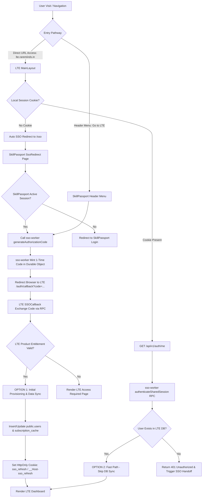

# Single Sign-On (SSO) Authentication & Data Provisioning Architecture

## Executive Summary

This document details the technical specification for Single Sign-On (SSO) authentication, cookie management, cross-application navigation, and data provisioning across **SkillPassport**, **LTE (Learner Transformer Engine)**, and **sso-worker**.

---

## 1. End-to-End System Architecture



---

## 2. Standardized Cookie Architecture

### Single Cookie Standard
All applications standardize on a single refresh token cookie without fallback chains or legacy multi-cookie names:

| Environment | Protocol | Cookie Name | Security Attributes | Scope |
| :--- | :--- | :--- | :--- | :--- |
| **Development** | HTTP (`http://127.0.0.1`) | `sso_refresh` | `HttpOnly; SameSite=Lax; Path=/` | Host-only |
| **Production** | HTTPS (`https://*.rareminds.in`) | `__Host-sso_refresh` | `HttpOnly; Secure; SameSite=Lax; Path=/` | Cross-Subdomain (`Domain=.rareminds.in`) |

---

## 3. Entry Pathways & Execution Mechanics

### Pathway A: Direct URL Access (`http://127.0.0.1:8789/dashboard`)
1. User visits LTE directly in their browser.
2. `MainLayout.tsx` checks for a local session cookie (`/api/v1/auth/refresh`).
3. If unauthenticated, `MainLayout.tsx` automatically initiates a silent redirect to SkillPassport:
   ```typescript
   const redirectUri = encodeURIComponent(`${window.location.origin}/auth/callback`);
   const ssoLoginUrl = `${skillpassportUrl}/sso?target_app=lte&redirect_uri=${redirectUri}`;
   window.location.href = ssoLoginUrl;
   ```
4. SkillPassport's `SsoRedirect.tsx` verifies the active session for the user, requests a single-use authorization code from `sso-worker`, and redirects back to LTE callback (`/auth/callback?code=...`).
5. LTE `/auth/callback` exchanges the code, provisions the local user, sets the cookie, and renders `/dashboard` **with 0 user clicks**.

### Pathway B: "Go to LTE" Header Button Navigation
1. User clicks `"Go to LTE"` inside SkillPassport header menu.
2. SkillPassport calls `/api/auth/generate-lte-code` directly via JS.
3. `sso-worker` generates a 1-time authorization code in a Cloudflare Durable Object.
4. SkillPassport navigates the browser directly to LTE callback:
   `http://127.0.0.1:8789/auth/callback?code=...`
5. LTE exchanges the code and loads `/dashboard` in a single instant jump.

---

## 4. Provisioning Rules: Option 1 vs Option 2

```
                       Check LTE Local Database (public.users)
                                          │
                 ┌────────────────────────┴────────────────────────┐
                 ▼                                                 ▼
      Option 1: User Data NOT Found                     Option 2: User Data IS Found
      - Performs initial provisioning                   - FAST PATH: Skips DB sync completely
      - Inserts into public.users                       - 0 Database Writes
      - Populates subscription_cache                    - Loads session in <50ms
```

### Data Validation & Enforcement
* **`/api/v1/auth/sso/exchange` (SSO Code Exchange):** Performs Option 1 provisioning conditionally if records are missing from `public.users` or `public.subscription_cache`.
* **`/api/v1/auth/me` (Page Refreshes & Navigations):** Performs Option 2 fast path checks. If a user record is missing from LTE's local database during `/me`, LTE returns a `401 Unauthorized` response to enforce proper SSO provisioning.

---

## 5. Deployment Modes: Integrated vs Standalone

The architecture supports both deployment modes using the exact same codebase and cookie helpers:

| Configuration | Mode 1: Integrated (SkillPassport + LTE) | Mode 2: Standalone LTE |
| :--- | :--- | :--- |
| **Domain** | `Domain=.rareminds.in` | Host-only (`lte.customer.com`) |
| **JWT Product Claim** | `products: ["skillpassport", "lte"]` | `products: ["lte"]` |
| **Authentication** | Shared Single Sign-On (0-click handoff) | Standalone direct login (`/login`) |
